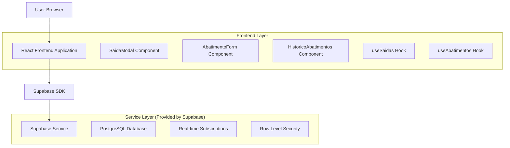
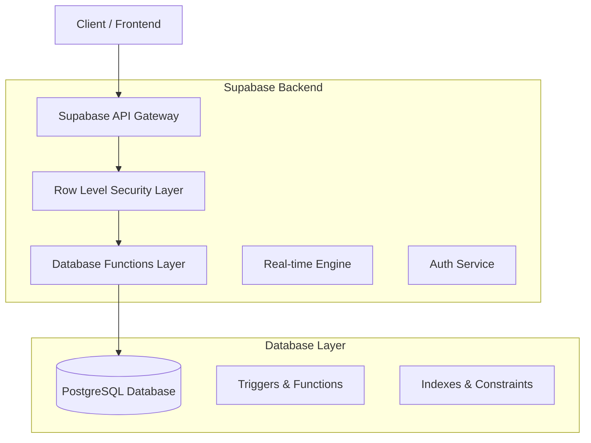
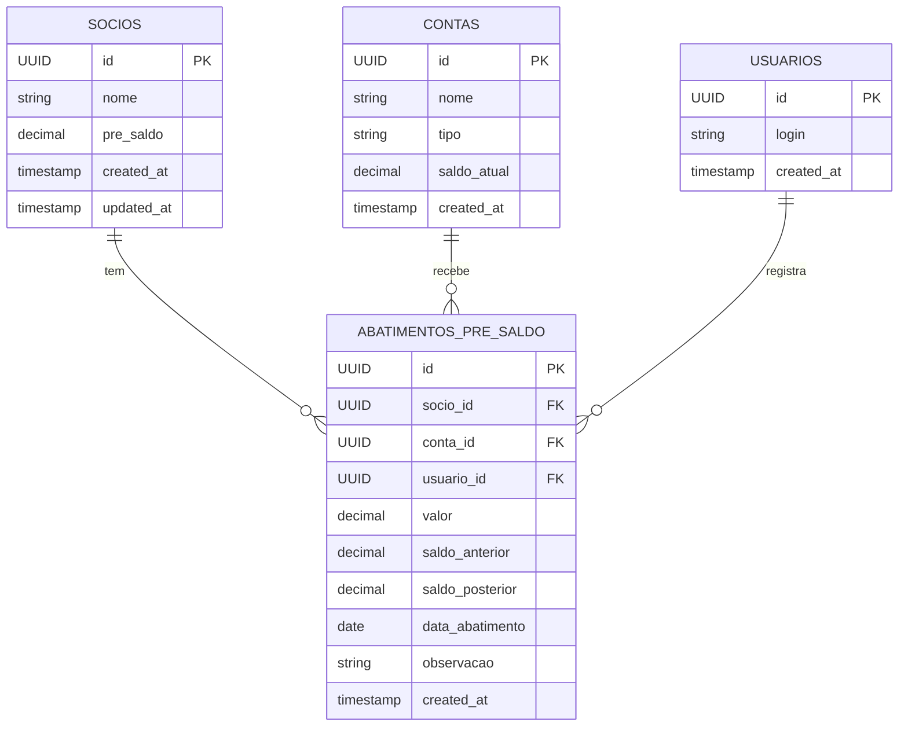

# Arquitetura Técnica - Sistema de Abatimento de Pré-Saldo

## 1. Design da Arquitetura



## 2. Descrição da Tecnologia

- Frontend: React@18 + TypeScript + tailwindcss@3 + vite + shadcn/ui
- Backend: Supabase (PostgreSQL + Real-time + Auth + RLS)
- Estado: React hooks customizados + useState/useEffect
- Validação: Zod schemas + react-hook-form
- UI Components: shadcn/ui + lucide-react icons

## 3. Definições de Rotas

| Rota | Propósito |
|------|-----------|
| /contas | Página principal de contas com nova opção de abatimento |
| /socios | Página de sócios com saldos atualizados e acesso ao histórico |
| /contas?tipo=abatimento | Filtro direto para abatimentos na página de contas |
| /socios/:id/historico | Modal overlay para histórico individual do sócio |

## 4. Definições de API

### 4.1 API Principal

**Registrar Abatimento de Pré-Saldo**
```
POST /rest/v1/abatimentos_pre_saldo
```

Request:
| Nome do Parâmetro | Tipo | Obrigatório | Descrição |
|-------------------|------|-------------|-----------|
| socio_id | UUID | true | ID do sócio para abatimento |
| valor | number | true | Valor do abatimento (positivo) |
| conta_id | UUID | true | Conta de destino do valor |
| data_abatimento | date | true | Data do abatimento |
| observacao | string | false | Observações sobre o abatimento |

Response:
| Nome do Parâmetro | Tipo | Descrição |
|-------------------|------|-----------|
| id | UUID | ID único do abatimento |
| socio_id | UUID | ID do sócio |
| valor | number | Valor abatido |
| saldo_anterior | number | Saldo antes do abatimento |
| saldo_posterior | number | Saldo após o abatimento |
| created_at | timestamp | Data de criação do registro |

**Buscar Histórico de Abatimentos**
```
GET /rest/v1/abatimentos_pre_saldo
```

Query Parameters:
| Nome do Parâmetro | Tipo | Obrigatório | Descrição |
|-------------------|------|-------------|-----------|
| socio_id | UUID | false | Filtrar por sócio específico |
| data_inicio | date | false | Data inicial do período |
| data_fim | date | false | Data final do período |
| limit | number | false | Limite de registros (padrão: 50) |
| offset | number | false | Offset para paginação |

**Atualizar Pré-Saldo do Sócio**
```
PATCH /rest/v1/socios
```

Request:
| Nome do Parâmetro | Tipo | Obrigatório | Descrição |
|-------------------|------|-------------|-----------|
| id | UUID | true | ID do sócio |
| pre_saldo | number | true | Novo valor do pré-saldo |

## 5. Arquitetura do Servidor



## 6. Modelo de Dados

### 6.1 Definição do Modelo de Dados



### 6.2 Linguagem de Definição de Dados

**Tabela de Abatimentos de Pré-Saldo (abatimentos_pre_saldo)**
```sql
-- Criar tabela de abatimentos
CREATE TABLE abatimentos_pre_saldo (
    id UUID PRIMARY KEY DEFAULT gen_random_uuid(),
    socio_id UUID NOT NULL REFERENCES socios(id) ON DELETE CASCADE,
    conta_id UUID NOT NULL REFERENCES contas(id) ON DELETE RESTRICT,
    usuario_id UUID NOT NULL REFERENCES usuarios(id) ON DELETE RESTRICT,
    valor DECIMAL(14,2) NOT NULL CHECK (valor > 0),
    saldo_anterior DECIMAL(14,2) NOT NULL,
    saldo_posterior DECIMAL(14,2) NOT NULL,
    data_abatimento DATE NOT NULL DEFAULT CURRENT_DATE,
    observacao TEXT,
    created_at TIMESTAMP WITH TIME ZONE DEFAULT NOW()
);

-- Criar índices para performance
CREATE INDEX idx_abatimentos_socio_id ON abatimentos_pre_saldo(socio_id);
CREATE INDEX idx_abatimentos_data ON abatimentos_pre_saldo(data_abatimento DESC);
CREATE INDEX idx_abatimentos_conta_id ON abatimentos_pre_saldo(conta_id);
CREATE INDEX idx_abatimentos_usuario_id ON abatimentos_pre_saldo(usuario_id);

-- Função para atualizar pré-saldo automaticamente
CREATE OR REPLACE FUNCTION atualizar_pre_saldo_abatimento()
RETURNS TRIGGER AS $$
BEGIN
    -- Registrar saldo anterior
    SELECT pre_saldo INTO NEW.saldo_anterior 
    FROM socios WHERE id = NEW.socio_id;
    
    -- Verificar se há saldo suficiente
    IF NEW.saldo_anterior < NEW.valor THEN
        RAISE EXCEPTION 'Saldo insuficiente. Saldo atual: %, Valor solicitado: %', 
            NEW.saldo_anterior, NEW.valor;
    END IF;
    
    -- Calcular novo saldo
    NEW.saldo_posterior := NEW.saldo_anterior - NEW.valor;
    
    -- Atualizar pré-saldo do sócio
    UPDATE socios 
    SET pre_saldo = NEW.saldo_posterior,
        updated_at = NOW()
    WHERE id = NEW.socio_id;
    
    RETURN NEW;
END;
$$ LANGUAGE plpgsql;

-- Criar trigger para execução automática
CREATE TRIGGER trigger_atualizar_pre_saldo_abatimento
    BEFORE INSERT ON abatimentos_pre_saldo
    FOR EACH ROW
    EXECUTE FUNCTION atualizar_pre_saldo_abatimento();

-- Políticas RLS (Row Level Security)
ALTER TABLE abatimentos_pre_saldo ENABLE ROW LEVEL SECURITY;

CREATE POLICY "Usuários autenticados podem ver abatimentos" ON abatimentos_pre_saldo
    FOR SELECT USING (auth.role() = 'authenticated');

CREATE POLICY "Usuários autenticados podem inserir abatimentos" ON abatimentos_pre_saldo
    FOR INSERT WITH CHECK (auth.role() = 'authenticated');

-- Dados iniciais (se necessário)
-- Nenhum dado inicial necessário para abatimentos
```

**Atualização da Tabela Sócios**
```sql
-- Adicionar campo updated_at se não existir
ALTER TABLE socios 
ADD COLUMN IF NOT EXISTS updated_at TIMESTAMP WITH TIME ZONE DEFAULT NOW();

-- Criar trigger para atualizar updated_at automaticamente
CREATE OR REPLACE FUNCTION update_updated_at_column()
RETURNS TRIGGER AS $$
BEGIN
    NEW.updated_at = NOW();
    RETURN NEW;
END;
$$ LANGUAGE plpgsql;

CREATE TRIGGER trigger_socios_updated_at
    BEFORE UPDATE ON socios
    FOR EACH ROW
    EXECUTE FUNCTION update_updated_at_column();
```