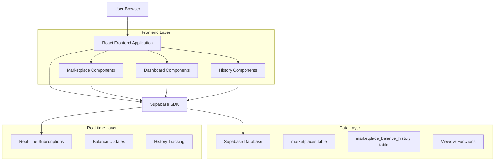
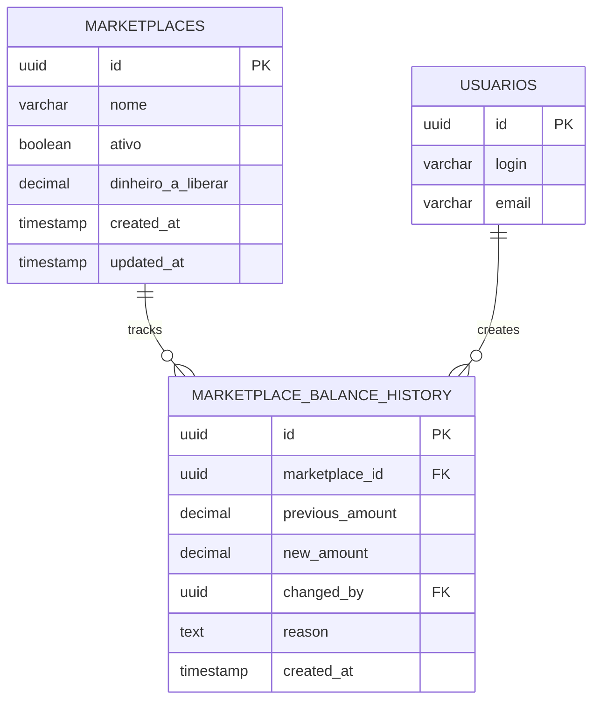

# Arquitetura Técnica - Dinheiro a Liberar em Marketplaces

## 1. Architecture design



## 2. Technology Description

- Frontend: React@18 + TypeScript + tailwindcss@3 + vite
- Backend: Supabase (PostgreSQL + Real-time)
- State Management: React Hooks + Context API
- UI Components: shadcn/ui + Lucide Icons

## 3. Route definitions

| Route | Purpose |
|-------|---------|
| /marketplaces | Página principal de marketplaces com gestão de valores bloqueados |
| /dashboard | Dashboard com resumo consolidado dos valores bloqueados |
| /marketplaces/history | Histórico de alterações nos valores bloqueados |

## 4. API definitions

### 4.1 Core API

**Atualizar valor bloqueado do marketplace**
```
PUT /rest/v1/marketplaces
```

Request:
| Param Name | Param Type | isRequired | Description |
|------------|------------|------------|-------------|
| id | string (UUID) | true | ID do marketplace |
| dinheiro_a_liberar | number | true | Valor bloqueado a ser liberado |

Response:
| Param Name | Param Type | Description |
|------------|------------|-------------|
| id | string | ID do marketplace atualizado |
| dinheiro_a_liberar | number | Novo valor bloqueado |
| updated_at | string | Timestamp da atualização |

**Buscar totais de valores bloqueados**
```
GET /rest/v1/rpc/get_total_blocked_amounts
```

Response:
| Param Name | Param Type | Description |
|------------|------------|-------------|
| total_blocked | number | Soma total de valores bloqueados |
| marketplaces_count | number | Quantidade de marketplaces com valores bloqueados |
| breakdown | array | Detalhamento por marketplace |

**Histórico de alterações**
```
GET /rest/v1/marketplace_balance_history
```

Response:
| Param Name | Param Type | Description |
|------------|------------|-------------|
| id | string | ID do registro de histórico |
| marketplace_id | string | ID do marketplace |
| previous_amount | number | Valor anterior |
| new_amount | number | Novo valor |
| changed_by | string | Usuário que fez a alteração |
| created_at | string | Data da alteração |

## 5. Data model

### 5.1 Data model definition



### 5.2 Data Definition Language

**Atualizar tabela marketplaces**
```sql
-- Adicionar coluna dinheiro_a_liberar
ALTER TABLE marketplaces 
ADD COLUMN dinheiro_a_liberar DECIMAL(15,2) DEFAULT 0.00 NOT NULL;

-- Adicionar índice para performance
CREATE INDEX idx_marketplaces_dinheiro_a_liberar ON marketplaces(dinheiro_a_liberar);

-- Adicionar constraint para valores não negativos
ALTER TABLE marketplaces 
ADD CONSTRAINT chk_dinheiro_a_liberar_positive 
CHECK (dinheiro_a_liberar >= 0);
```

**Criar tabela de histórico**
```sql
-- Criar tabela marketplace_balance_history
CREATE TABLE marketplace_balance_history (
    id UUID PRIMARY KEY DEFAULT gen_random_uuid(),
    marketplace_id UUID NOT NULL REFERENCES marketplaces(id) ON DELETE CASCADE,
    previous_amount DECIMAL(15,2) NOT NULL DEFAULT 0.00,
    new_amount DECIMAL(15,2) NOT NULL DEFAULT 0.00,
    changed_by UUID NOT NULL REFERENCES usuarios(id),
    reason TEXT,
    created_at TIMESTAMP WITH TIME ZONE DEFAULT NOW()
);

-- Índices para performance
CREATE INDEX idx_marketplace_balance_history_marketplace_id ON marketplace_balance_history(marketplace_id);
CREATE INDEX idx_marketplace_balance_history_created_at ON marketplace_balance_history(created_at DESC);
CREATE INDEX idx_marketplace_balance_history_changed_by ON marketplace_balance_history(changed_by);
```

**Função para calcular totais**
```sql
-- Função para obter totais de valores bloqueados
CREATE OR REPLACE FUNCTION get_total_blocked_amounts()
RETURNS JSON AS $$
DECLARE
    result JSON;
BEGIN
    SELECT json_build_object(
        'total_blocked', COALESCE(SUM(dinheiro_a_liberar), 0),
        'marketplaces_count', COUNT(*) FILTER (WHERE dinheiro_a_liberar > 0),
        'breakdown', json_agg(
            json_build_object(
                'marketplace_id', id,
                'nome', nome,
                'dinheiro_a_liberar', dinheiro_a_liberar
            )
        ) FILTER (WHERE dinheiro_a_liberar > 0)
    ) INTO result
    FROM marketplaces
    WHERE ativo = true;
    
    RETURN result;
END;
$$ LANGUAGE plpgsql SECURITY DEFINER;
```

**Trigger para histórico automático**
```sql
-- Função trigger para registrar alterações
CREATE OR REPLACE FUNCTION log_marketplace_balance_change()
RETURNS TRIGGER AS $$
BEGIN
    -- Só registra se o valor mudou
    IF OLD.dinheiro_a_liberar != NEW.dinheiro_a_liberar THEN
        INSERT INTO marketplace_balance_history (
            marketplace_id,
            previous_amount,
            new_amount,
            changed_by,
            reason
        ) VALUES (
            NEW.id,
            OLD.dinheiro_a_liberar,
            NEW.dinheiro_a_liberar,
            auth.uid(),
            'Alteração manual via interface'
        );
    END IF;
    
    RETURN NEW;
END;
$$ LANGUAGE plpgsql SECURITY DEFINER;

-- Criar trigger
CREATE TRIGGER marketplace_balance_change_trigger
    AFTER UPDATE ON marketplaces
    FOR EACH ROW
    EXECUTE FUNCTION log_marketplace_balance_change();
```

**Políticas RLS**
```sql
-- RLS para marketplace_balance_history
ALTER TABLE marketplace_balance_history ENABLE ROW LEVEL SECURITY;

-- Política de leitura
CREATE POLICY "Usuários autenticados podem ler histórico" ON marketplace_balance_history
    FOR SELECT USING (auth.role() = 'authenticated');

-- Política de inserção (apenas via trigger)
CREATE POLICY "Sistema pode inserir histórico" ON marketplace_balance_history
    FOR INSERT WITH CHECK (true);

-- Atualizar políticas existentes dos marketplaces para incluir nova coluna
-- (As políticas existentes já cobrem a nova coluna)
```