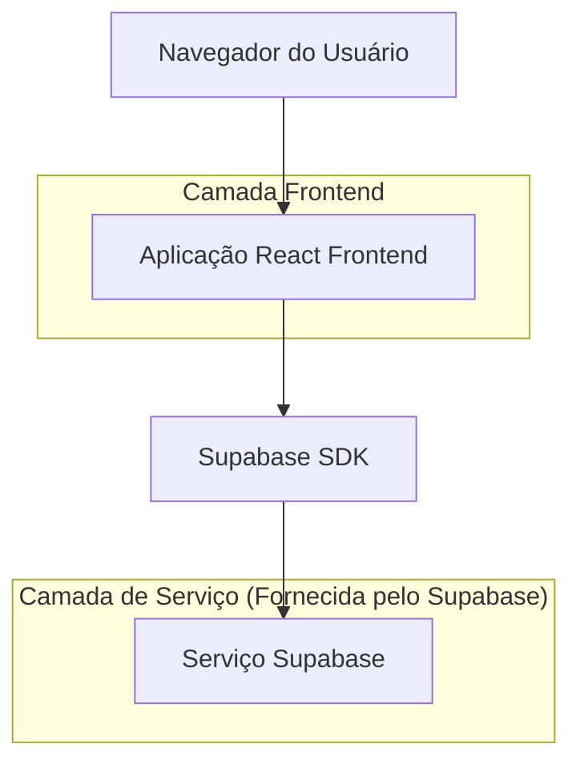
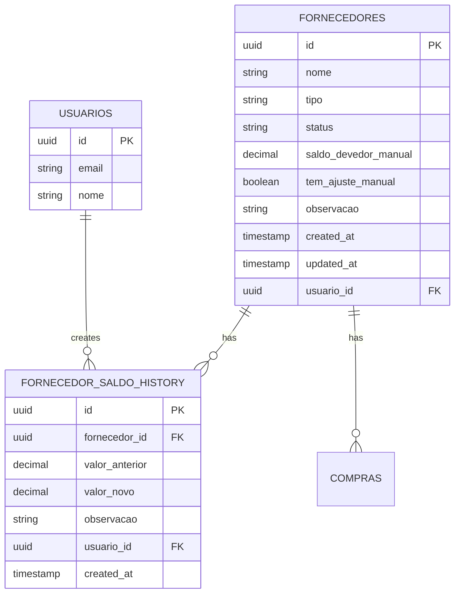

# Arquitetura Técnica - Sistema de Edição de Saldo Devedor de Fornecedores

## 1. Design da Arquitetura



## 2. Descrição das Tecnologias

- Frontend: React@18 + tailwindcss@3 + vite
- Backend: Supabase (PostgreSQL + Auth + RLS)

## 3. Definições de Rotas

| Rota | Propósito |
|------|-----------|
| /fornecedores | Página principal de fornecedores com funcionalidade de edição de saldo |
| /fornecedores/:id | Página de detalhes do fornecedor incluindo histórico de ajustes de saldo |

## 4. Definições de API

### 4.1 API Principal

**Atualização de saldo devedor**
```
PUT /rest/v1/fornecedores
```

Requisição:
| Nome do Parâmetro | Tipo do Parâmetro | Obrigatório | Descrição |
|-------------------|-------------------|-------------|-----------|
| id | string (UUID) | true | ID do fornecedor |
| saldo_devedor_manual | number | true | Novo valor do saldo devedor |

Resposta:
| Nome do Parâmetro | Tipo do Parâmetro | Descrição |
|-------------------|-------------------|-----------|
| success | boolean | Status da operação |

**Criação de histórico de ajuste**
```
POST /rest/v1/fornecedor_saldo_history
```

Requisição:
| Nome do Parâmetro | Tipo do Parâmetro | Obrigatório | Descrição |
|-------------------|-------------------|-------------|-----------|
| fornecedor_id | string (UUID) | true | ID do fornecedor |
| valor_anterior | number | true | Valor anterior do saldo |
| valor_novo | number | true | Novo valor do saldo |
| observacao | string | true | Motivo do ajuste |

Exemplo:
```json
{
  "fornecedor_id": "123e4567-e89b-12d3-a456-426614174000",
  "valor_anterior": 1500.00,
  "valor_novo": 2000.00,
  "observacao": "Ajuste por acordo comercial"
}
```

## 5. Modelo de Dados

### 5.1 Definição do Modelo de Dados



### 5.2 Linguagem de Definição de Dados

**Tabela de Fornecedores (atualização)**
```sql
-- Adicionar colunas para saldo manual
ALTER TABLE fornecedores 
ADD COLUMN IF NOT EXISTS saldo_devedor_manual DECIMAL(10,2) DEFAULT 0,
ADD COLUMN IF NOT EXISTS tem_ajuste_manual BOOLEAN DEFAULT FALSE;

-- Índices para performance
CREATE INDEX IF NOT EXISTS idx_fornecedores_ajuste_manual ON fornecedores(tem_ajuste_manual);
```

**Tabela de Histórico de Saldo (criação)**
```sql
-- Criar tabela de histórico
CREATE TABLE fornecedor_saldo_history (
    id UUID PRIMARY KEY DEFAULT gen_random_uuid(),
    fornecedor_id UUID NOT NULL REFERENCES fornecedores(id) ON DELETE CASCADE,
    valor_anterior DECIMAL(10,2) NOT NULL,
    valor_novo DECIMAL(10,2) NOT NULL,
    observacao TEXT NOT NULL,
    usuario_id UUID NOT NULL REFERENCES auth.users(id),
    created_at TIMESTAMP WITH TIME ZONE DEFAULT NOW()
);

-- Índices
CREATE INDEX idx_fornecedor_saldo_history_fornecedor_id ON fornecedor_saldo_history(fornecedor_id);
CREATE INDEX idx_fornecedor_saldo_history_created_at ON fornecedor_saldo_history(created_at DESC);

-- RLS Policies
ALTER TABLE fornecedor_saldo_history ENABLE ROW LEVEL SECURITY;

-- Política para visualização (usuários autenticados)
CREATE POLICY "Usuários autenticados podem visualizar histórico de saldo" ON fornecedor_saldo_history
    FOR SELECT USING (auth.role() = 'authenticated');

-- Política para inserção (usuários autenticados)
CREATE POLICY "Usuários autenticados podem inserir histórico de saldo" ON fornecedor_saldo_history
    FOR INSERT WITH CHECK (auth.role() = 'authenticated' AND auth.uid() = usuario_id);

-- Função para atualizar saldo com histórico
CREATE OR REPLACE FUNCTION update_fornecedor_saldo_manual(
    p_fornecedor_id UUID,
    p_novo_saldo DECIMAL(10,2),
    p_observacao TEXT
) RETURNS BOOLEAN AS $$
DECLARE
    v_saldo_anterior DECIMAL(10,2);
BEGIN
    -- Buscar saldo anterior
    SELECT COALESCE(saldo_devedor_manual, 0) INTO v_saldo_anterior
    FROM fornecedores 
    WHERE id = p_fornecedor_id;
    
    -- Atualizar fornecedor
    UPDATE fornecedores 
    SET 
        saldo_devedor_manual = p_novo_saldo,
        tem_ajuste_manual = TRUE,
        updated_at = NOW()
    WHERE id = p_fornecedor_id;
    
    -- Inserir histórico
    INSERT INTO fornecedor_saldo_history (
        fornecedor_id, valor_anterior, valor_novo, observacao, usuario_id
    ) VALUES (
        p_fornecedor_id, v_saldo_anterior, p_novo_saldo, p_observacao, auth.uid()
    );
    
    RETURN TRUE;
END;
$$ LANGUAGE plpgsql SECURITY DEFINER;

-- Dados iniciais
UPDATE fornecedores 
SET saldo_devedor_manual = 0, tem_ajuste_manual = FALSE 
WHERE saldo_devedor_manual IS NULL;
```