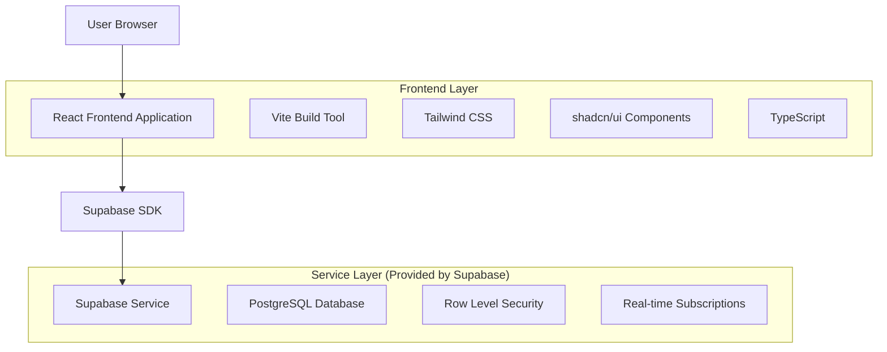
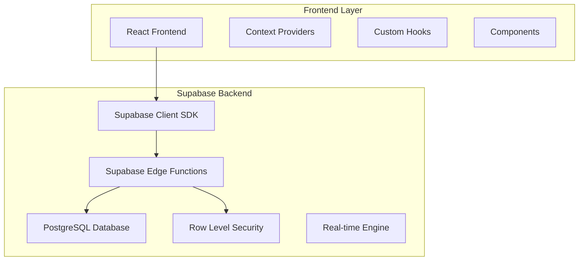
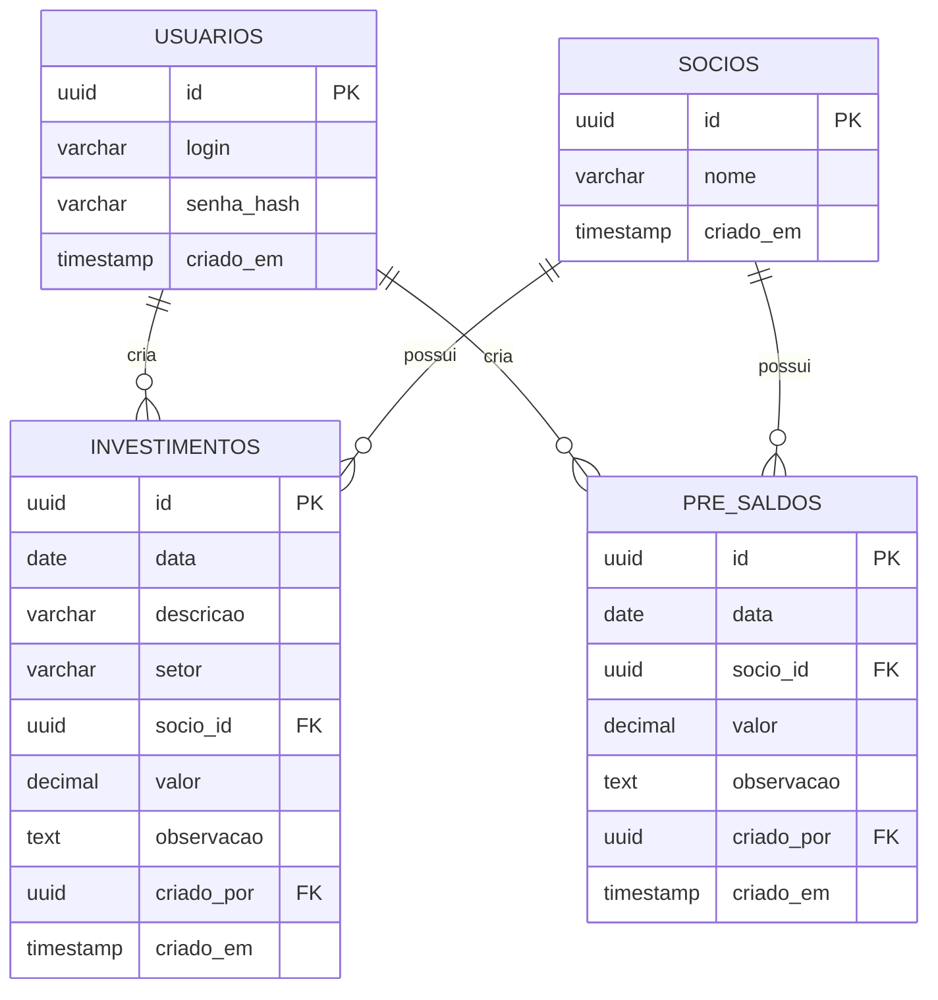

# Arquitetura Técnica - Financeiro DEBAJEYU

## 1. Architecture design



## 2. Technology Description

- Frontend: React@18 + TypeScript@5 + Vite@5 + Tailwind CSS@3 + shadcn/ui
- Backend: Supabase (PostgreSQL + Auth + Real-time)
- Authentication: Custom JWT with bcrypt password hashing
- State Management: React Context + useState/useEffect
- Form Handling: React Hook Form + Zod validation
- Currency Formatting: Intl.NumberFormat (BRL)

## 3. Route definitions

| Route | Purpose |
|-------|---------|
| /login | Página de autenticação com usuário e senha |
| /dashboard | Dashboard principal com resumo financeiro e últimos lançamentos |
| /investimentos | Listagem completa de investimentos com CRUD |
| /pre-saldo | Listagem completa de pré-saldos com CRUD |
| / | Redirect para /login ou /dashboard baseado na autenticação |

## 4. API definitions

### 4.1 Core API

**Autenticação**
```
POST /auth/login
```

Request:
| Param Name| Param Type  | isRequired  | Description |
|-----------|-------------|-------------|-------------|
| login     | string      | true        | Nome de usuário |
| senha     | string      | true        | Senha em texto plano |

Response:
| Param Name| Param Type  | Description |
|-----------|-------------|-------------|
| success   | boolean     | Status da autenticação |
| token     | string      | JWT token para sessão |
| user      | object      | Dados do usuário autenticado |

**Investimentos**
```
GET /investimentos
POST /investimentos
PUT /investimentos/:id
DELETE /investimentos/:id
```

**Pré-Saldos**
```
GET /pre_saldos
POST /pre_saldos
PUT /pre_saldos/:id
DELETE /pre_saldos/:id
```

**Sócios**
```
GET /socios
```

## 5. Server architecture diagram



## 6. Data model

### 6.1 Data model definition



### 6.2 Data Definition Language

**Tabela de Usuários**
```sql
-- Criar tabela usuarios
CREATE TABLE usuarios (
    id UUID PRIMARY KEY DEFAULT gen_random_uuid(),
    login VARCHAR(50) UNIQUE NOT NULL,
    senha_hash VARCHAR(255) NOT NULL,
    criado_em TIMESTAMP WITH TIME ZONE DEFAULT NOW()
);

-- Habilitar RLS
ALTER TABLE usuarios ENABLE ROW LEVEL SECURITY;

-- Política RLS para usuarios
CREATE POLICY "Usuarios podem ver apenas seus próprios dados" ON usuarios
    FOR ALL USING (auth.uid() = id);
```

**Tabela de Sócios**
```sql
-- Criar tabela socios
CREATE TABLE socios (
    id UUID PRIMARY KEY DEFAULT gen_random_uuid(),
    nome VARCHAR(100) NOT NULL,
    criado_em TIMESTAMP WITH TIME ZONE DEFAULT NOW()
);

-- Habilitar RLS
ALTER TABLE socios ENABLE ROW LEVEL SECURITY;

-- Política RLS para socios
CREATE POLICY "Usuários autenticados podem ver todos os sócios" ON socios
    FOR SELECT USING (auth.role() = 'authenticated');

-- Dados iniciais dos sócios
INSERT INTO socios (nome) VALUES 
    ('Jean'),
    ('Yuri'),
    ('Bárbara');
```

**Tabela de Investimentos**
```sql
-- Criar tabela investimentos
CREATE TABLE investimentos (
    id UUID PRIMARY KEY DEFAULT gen_random_uuid(),
    data DATE NOT NULL,
    descricao VARCHAR(255) NOT NULL,
    setor VARCHAR(100),
    socio_id UUID NOT NULL REFERENCES socios(id),
    valor DECIMAL(15,2) NOT NULL,
    observacao TEXT,
    criado_por UUID NOT NULL,
    criado_em TIMESTAMP WITH TIME ZONE DEFAULT NOW()
);

-- Habilitar RLS
ALTER TABLE investimentos ENABLE ROW LEVEL SECURITY;

-- Políticas RLS para investimentos
CREATE POLICY "Usuários autenticados podem ver todos os investimentos" ON investimentos
    FOR SELECT USING (auth.role() = 'authenticated');

CREATE POLICY "Usuários autenticados podem inserir investimentos" ON investimentos
    FOR INSERT WITH CHECK (auth.role() = 'authenticated');

CREATE POLICY "Usuários podem editar investimentos que criaram" ON investimentos
    FOR UPDATE USING (criado_por = auth.uid());

CREATE POLICY "Usuários podem deletar investimentos que criaram" ON investimentos
    FOR DELETE USING (criado_por = auth.uid());

-- Índices para performance
CREATE INDEX idx_investimentos_socio_id ON investimentos(socio_id);
CREATE INDEX idx_investimentos_data ON investimentos(data DESC);
CREATE INDEX idx_investimentos_criado_por ON investimentos(criado_por);
```

**Tabela de Pré-Saldos**
```sql
-- Criar tabela pre_saldos
CREATE TABLE pre_saldos (
    id UUID PRIMARY KEY DEFAULT gen_random_uuid(),
    data DATE NOT NULL,
    socio_id UUID NOT NULL REFERENCES socios(id),
    valor DECIMAL(15,2) NOT NULL,
    observacao TEXT,
    criado_por UUID NOT NULL,
    criado_em TIMESTAMP WITH TIME ZONE DEFAULT NOW()
);

-- Habilitar RLS
ALTER TABLE pre_saldos ENABLE ROW LEVEL SECURITY;

-- Políticas RLS para pre_saldos
CREATE POLICY "Usuários autenticados podem ver todos os pré-saldos" ON pre_saldos
    FOR SELECT USING (auth.role() = 'authenticated');

CREATE POLICY "Usuários autenticados podem inserir pré-saldos" ON pre_saldos
    FOR INSERT WITH CHECK (auth.role() = 'authenticated');

CREATE POLICY "Usuários podem editar pré-saldos que criaram" ON pre_saldos
    FOR UPDATE USING (criado_por = auth.uid());

CREATE POLICY "Usuários podem deletar pré-saldos que criaram" ON pre_saldos
    FOR DELETE USING (criado_por = auth.uid());

-- Índices para performance
CREATE INDEX idx_pre_saldos_socio_id ON pre_saldos(socio_id);
CREATE INDEX idx_pre_saldos_data ON pre_saldos(data DESC);
CREATE INDEX idx_pre_saldos_criado_por ON pre_saldos(criado_por);
```

**Usuário Admin Inicial**
```sql
-- Inserir usuário admin (senha: admin123 - hash bcrypt)
INSERT INTO usuarios (login, senha_hash) VALUES 
    ('admin', '$2b$10$rQZ8kHWKtGKVQZ8kHWKtGOeX8kHWKtGKVQZ8kHWKtGKVQZ8kHWKtG');
```

**Grants de Permissão**
```sql
-- Conceder permissões básicas para role anon
GRANT SELECT ON socios TO anon;

-- Conceder permissões completas para role authenticated
GRANT ALL PRIVILEGES ON usuarios TO authenticated;
GRANT ALL PRIVILEGES ON socios TO authenticated;
GRANT ALL PRIVILEGES ON investimentos TO authenticated;
GRANT ALL PRIVILEGES ON pre_saldos TO authenticated;
```