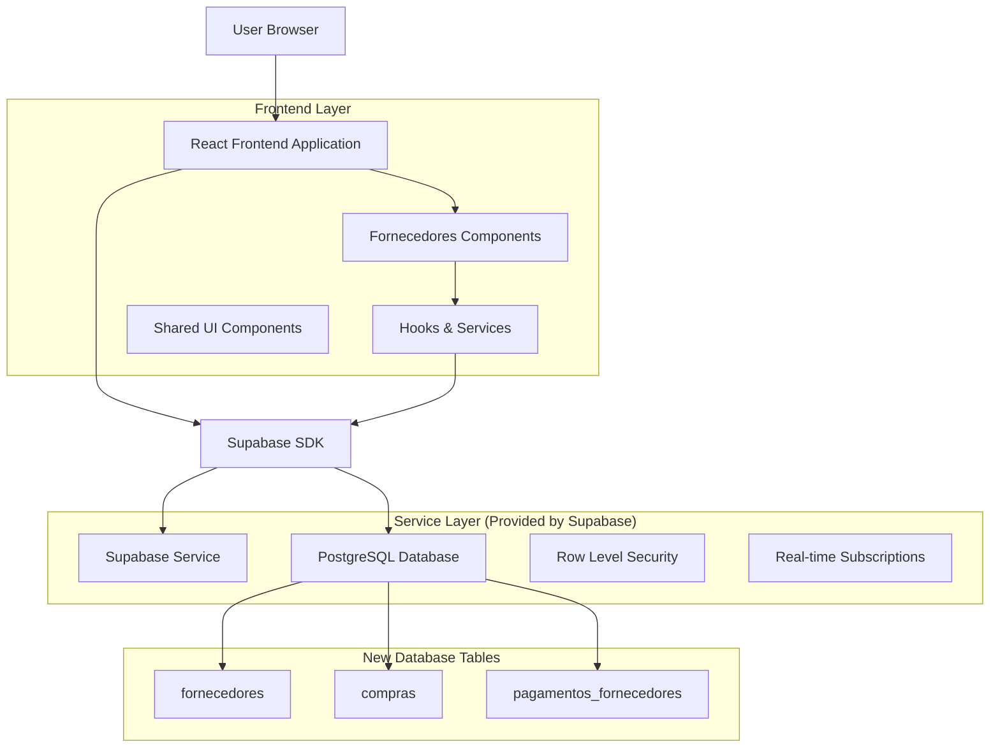
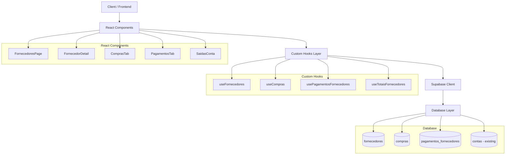
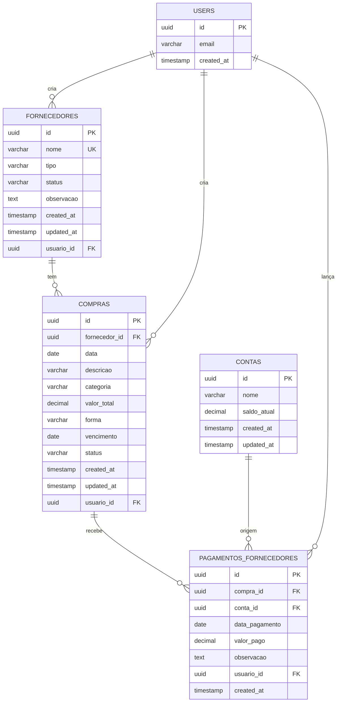

# Arquitetura Técnica - Módulo de Fornecedores - Sistema Financeiro DEBAJEYU

## 1. Architecture Design



## 2. Technology Description

- Frontend: React@18 + TypeScript + tailwindcss@3 + vite
- Backend: Supabase (PostgreSQL + Auth + RLS)
- UI Components: Reutilização dos componentes existentes (shadcn/ui)
- State Management: React hooks customizados
- Validação: Zod (seguindo padrão existente)
- Formatação: Reutilização do CurrencyInput existente

## 3. Route Definitions

| Route | Purpose |
|-------|---------|
| /fornecedores | Página principal de fornecedores com listagem e resumo geral |
| /fornecedores/:id | Página de detalhe do fornecedor com abas de compras e pagamentos |
| /contas | Página existente com nova seção de saídas integrada |
| /dashboard | Dashboard existente com novos cards de fornecedores |

## 4. API Definitions

### 4.1 Core API

**Fornecedores**
```typescript
// Tipos TypeScript
interface Fornecedor {
  id: string;
  nome: string;
  tipo: 'Camisa' | 'Gráfica' | 'Outros';
  status: 'Ativo' | 'Inativo';
  observacao?: string;
  created_at: string;
  updated_at: string;
  usuario_id: string;
}

interface FornecedorComTotais extends Fornecedor {
  total_gasto: number;
  total_pago: number;
  total_aberto: number;
}
```

**Compras**
```typescript
interface Compra {
  id: string;
  fornecedor_id: string;
  data: string;
  descricao: string;
  categoria: string;
  valor_total: number;
  forma: 'À Vista' | 'Fiado';
  vencimento?: string;
  status: 'Aberta' | 'Parcial' | 'Quitada';
  created_at: string;
  updated_at: string;
  usuario_id: string;
}

interface CompraComSaldo extends Compra {
  total_pago: number;
  saldo_aberto: number;
  fornecedor: {
    nome: string;
    tipo: string;
  };
}
```

**Pagamentos**
```typescript
interface PagamentoFornecedor {
  id: string;
  compra_id: string;
  conta_id: string;
  data_pagamento: string;
  valor_pago: number;
  observacao?: string;
  usuario_id: string;
  created_at: string;
}

interface PagamentoComDetalhes extends PagamentoFornecedor {
  compra: {
    descricao: string;
    fornecedor: {
      nome: string;
    };
  };
  conta: {
    nome: string;
  };
  usuario: {
    email: string;
  };
}
```

### 4.2 Supabase Queries

**Fornecedores com Totais**
```sql
SELECT 
  f.*,
  COALESCE(SUM(c.valor_total), 0) as total_gasto,
  COALESCE(SUM(p.valor_pago), 0) as total_pago,
  COALESCE(SUM(c.valor_total) - SUM(p.valor_pago), 0) as total_aberto
FROM fornecedores f
LEFT JOIN compras c ON f.id = c.fornecedor_id
LEFT JOIN pagamentos_fornecedores p ON c.id = p.compra_id
GROUP BY f.id
ORDER BY f.nome;
```

**Compras com Saldo**
```sql
SELECT 
  c.*,
  f.nome as fornecedor_nome,
  f.tipo as fornecedor_tipo,
  COALESCE(SUM(p.valor_pago), 0) as total_pago,
  c.valor_total - COALESCE(SUM(p.valor_pago), 0) as saldo_aberto
FROM compras c
JOIN fornecedores f ON c.fornecedor_id = f.id
LEFT JOIN pagamentos_fornecedores p ON c.id = p.compra_id
WHERE c.fornecedor_id = $1
GROUP BY c.id, f.nome, f.tipo
ORDER BY c.data DESC;
```

**Pagamentos com Detalhes**
```sql
SELECT 
  p.*,
  c.descricao as compra_descricao,
  f.nome as fornecedor_nome,
  co.nome as conta_nome,
  u.email as usuario_email
FROM pagamentos_fornecedores p
JOIN compras c ON p.compra_id = c.id
JOIN fornecedores f ON c.fornecedor_id = f.id
JOIN contas co ON p.conta_id = co.id
JOIN auth.users u ON p.usuario_id = u.id
WHERE c.fornecedor_id = $1
ORDER BY p.data_pagamento DESC;
```

## 5. Server Architecture Diagram



## 6. Data Model

### 6.1 Data Model Definition



### 6.2 Data Definition Language

**Tabela Fornecedores**
```sql
-- Criar tabela fornecedores
CREATE TABLE fornecedores (
    id UUID PRIMARY KEY DEFAULT gen_random_uuid(),
    nome VARCHAR(255) NOT NULL,
    tipo VARCHAR(50) NOT NULL CHECK (tipo IN ('Camisa', 'Gráfica', 'Outros')),
    status VARCHAR(20) NOT NULL DEFAULT 'Ativo' CHECK (status IN ('Ativo', 'Inativo')),
    observacao TEXT,
    created_at TIMESTAMP WITH TIME ZONE DEFAULT NOW(),
    updated_at TIMESTAMP WITH TIME ZONE DEFAULT NOW(),
    usuario_id UUID NOT NULL REFERENCES auth.users(id),
    UNIQUE(nome, usuario_id)
);

-- Índices
CREATE INDEX idx_fornecedores_usuario_id ON fornecedores(usuario_id);
CREATE INDEX idx_fornecedores_tipo ON fornecedores(tipo);
CREATE INDEX idx_fornecedores_status ON fornecedores(status);

-- RLS Policies
ALTER TABLE fornecedores ENABLE ROW LEVEL SECURITY;

CREATE POLICY "Usuários podem ver todos os fornecedores" ON fornecedores
    FOR SELECT USING (auth.role() = 'authenticated');

CREATE POLICY "Usuários podem inserir próprios fornecedores" ON fornecedores
    FOR INSERT WITH CHECK (auth.uid() = usuario_id);

CREATE POLICY "Usuários podem atualizar próprios fornecedores" ON fornecedores
    FOR UPDATE USING (auth.uid() = usuario_id);

CREATE POLICY "Usuários podem deletar próprios fornecedores" ON fornecedores
    FOR DELETE USING (auth.uid() = usuario_id);

-- Trigger para updated_at
CREATE TRIGGER update_fornecedores_updated_at
    BEFORE UPDATE ON fornecedores
    FOR EACH ROW
    EXECUTE FUNCTION update_updated_at_column();
```

**Tabela Compras**
```sql
-- Criar tabela compras
CREATE TABLE compras (
    id UUID PRIMARY KEY DEFAULT gen_random_uuid(),
    fornecedor_id UUID NOT NULL REFERENCES fornecedores(id) ON DELETE CASCADE,
    data DATE NOT NULL,
    descricao VARCHAR(255) NOT NULL,
    categoria VARCHAR(100) NOT NULL,
    valor_total DECIMAL(10,2) NOT NULL CHECK (valor_total > 0),
    forma VARCHAR(20) NOT NULL CHECK (forma IN ('À Vista', 'Fiado')),
    vencimento DATE,
    status VARCHAR(20) NOT NULL DEFAULT 'Aberta' CHECK (status IN ('Aberta', 'Parcial', 'Quitada')),
    created_at TIMESTAMP WITH TIME ZONE DEFAULT NOW(),
    updated_at TIMESTAMP WITH TIME ZONE DEFAULT NOW(),
    usuario_id UUID NOT NULL REFERENCES auth.users(id)
);

-- Índices
CREATE INDEX idx_compras_fornecedor_id ON compras(fornecedor_id);
CREATE INDEX idx_compras_usuario_id ON compras(usuario_id);
CREATE INDEX idx_compras_data ON compras(data DESC);
CREATE INDEX idx_compras_status ON compras(status);

-- RLS Policies
ALTER TABLE compras ENABLE ROW LEVEL SECURITY;

CREATE POLICY "Usuários podem ver todas as compras" ON compras
    FOR SELECT USING (auth.role() = 'authenticated');

CREATE POLICY "Usuários podem inserir próprias compras" ON compras
    FOR INSERT WITH CHECK (auth.uid() = usuario_id);

CREATE POLICY "Usuários podem atualizar próprias compras" ON compras
    FOR UPDATE USING (auth.uid() = usuario_id);

CREATE POLICY "Usuários podem deletar próprias compras" ON compras
    FOR DELETE USING (auth.uid() = usuario_id);

-- Trigger para updated_at
CREATE TRIGGER update_compras_updated_at
    BEFORE UPDATE ON compras
    FOR EACH ROW
    EXECUTE FUNCTION update_updated_at_column();
```

**Tabela Pagamentos Fornecedores**
```sql
-- Criar tabela pagamentos_fornecedores
CREATE TABLE pagamentos_fornecedores (
    id UUID PRIMARY KEY DEFAULT gen_random_uuid(),
    compra_id UUID NOT NULL REFERENCES compras(id) ON DELETE CASCADE,
    conta_id UUID NOT NULL REFERENCES contas(id),
    data_pagamento DATE NOT NULL,
    valor_pago DECIMAL(10,2) NOT NULL CHECK (valor_pago > 0),
    observacao TEXT,
    usuario_id UUID NOT NULL REFERENCES auth.users(id),
    created_at TIMESTAMP WITH TIME ZONE DEFAULT NOW()
);

-- Índices
CREATE INDEX idx_pagamentos_fornecedores_compra_id ON pagamentos_fornecedores(compra_id);
CREATE INDEX idx_pagamentos_fornecedores_conta_id ON pagamentos_fornecedores(conta_id);
CREATE INDEX idx_pagamentos_fornecedores_usuario_id ON pagamentos_fornecedores(usuario_id);
CREATE INDEX idx_pagamentos_fornecedores_data ON pagamentos_fornecedores(data_pagamento DESC);

-- RLS Policies
ALTER TABLE pagamentos_fornecedores ENABLE ROW LEVEL SECURITY;

CREATE POLICY "Usuários podem ver todos os pagamentos" ON pagamentos_fornecedores
    FOR SELECT USING (auth.role() = 'authenticated');

CREATE POLICY "Usuários podem inserir próprios pagamentos" ON pagamentos_fornecedores
    FOR INSERT WITH CHECK (auth.uid() = usuario_id);

CREATE POLICY "Usuários podem atualizar próprios pagamentos" ON pagamentos_fornecedores
    FOR UPDATE USING (auth.uid() = usuario_id);

CREATE POLICY "Usuários podem deletar próprios pagamentos" ON pagamentos_fornecedores
    FOR DELETE USING (auth.uid() = usuario_id);
```

**Função para Atualizar Status da Compra**
```sql
-- Função para calcular e atualizar status da compra
CREATE OR REPLACE FUNCTION update_compra_status()
RETURNS TRIGGER AS $$
DECLARE
    total_pago DECIMAL(10,2);
    valor_total DECIMAL(10,2);
    novo_status VARCHAR(20);
BEGIN
    -- Buscar valor total da compra
    SELECT c.valor_total INTO valor_total
    FROM compras c
    WHERE c.id = COALESCE(NEW.compra_id, OLD.compra_id);
    
    -- Calcular total pago
    SELECT COALESCE(SUM(valor_pago), 0) INTO total_pago
    FROM pagamentos_fornecedores
    WHERE compra_id = COALESCE(NEW.compra_id, OLD.compra_id);
    
    -- Determinar novo status
    IF total_pago = 0 THEN
        novo_status := 'Aberta';
    ELSIF total_pago >= valor_total THEN
        novo_status := 'Quitada';
    ELSE
        novo_status := 'Parcial';
    END IF;
    
    -- Atualizar status da compra
    UPDATE compras
    SET status = novo_status, updated_at = NOW()
    WHERE id = COALESCE(NEW.compra_id, OLD.compra_id);
    
    RETURN COALESCE(NEW, OLD);
END;
$$ LANGUAGE plpgsql;

-- Triggers para atualizar status automaticamente
CREATE TRIGGER trigger_update_compra_status_insert
    AFTER INSERT ON pagamentos_fornecedores
    FOR EACH ROW
    EXECUTE FUNCTION update_compra_status();

CREATE TRIGGER trigger_update_compra_status_update
    AFTER UPDATE ON pagamentos_fornecedores
    FOR EACH ROW
    EXECUTE FUNCTION update_compra_status();

CREATE TRIGGER trigger_update_compra_status_delete
    AFTER DELETE ON pagamentos_fornecedores
    FOR EACH ROW
    EXECUTE FUNCTION update_compra_status();
```

**Views para Relatórios**
```sql
-- View para fornecedores com totais
CREATE VIEW view_fornecedores_totais AS
SELECT 
    f.*,
    COALESCE(SUM(c.valor_total), 0) as total_gasto,
    COALESCE(SUM(p.valor_pago), 0) as total_pago,
    COALESCE(SUM(c.valor_total) - SUM(p.valor_pago), 0) as total_aberto
FROM fornecedores f
LEFT JOIN compras c ON f.id = c.fornecedor_id
LEFT JOIN pagamentos_fornecedores p ON c.id = p.compra_id
GROUP BY f.id, f.nome, f.tipo, f.status, f.observacao, f.created_at, f.updated_at, f.usuario_id;

-- View para compras com saldo
CREATE VIEW view_compras_saldo AS
SELECT 
    c.*,
    f.nome as fornecedor_nome,
    f.tipo as fornecedor_tipo,
    COALESCE(SUM(p.valor_pago), 0) as total_pago,
    c.valor_total - COALESCE(SUM(p.valor_pago), 0) as saldo_aberto
FROM compras c
JOIN fornecedores f ON c.fornecedor_id = f.id
LEFT JOIN pagamentos_fornecedores p ON c.id = p.compra_id
GROUP BY c.id, c.fornecedor_id, c.data, c.descricao, c.categoria, c.valor_total, 
         c.forma, c.vencimento, c.status, c.created_at, c.updated_at, c.usuario_id,
         f.nome, f.tipo;
```

**Dados Iniciais**
```sql
-- Inserir tipos de fornecedores padrão (opcional)
-- Os tipos são definidos via CHECK constraint, não precisam de tabela separada

-- Exemplo de fornecedores iniciais (opcional)
INSERT INTO fornecedores (nome, tipo, status, observacao, usuario_id) VALUES
('Fornecedor Exemplo', 'Outros', 'Ativo', 'Fornecedor de exemplo para testes', 
 (SELECT id FROM auth.users LIMIT 1));
```

## 7. Integração com Sistema Existente

### 7.1 Hooks Customizados

**useFornecedores.ts**
```typescript
export const useFornecedores = () => {
  const [fornecedores, setFornecedores] = useState<FornecedorComTotais[]>([]);
  const [loading, setLoading] = useState(true);
  
  const fetchFornecedores = async () => {
    // Query usando view_fornecedores_totais
  };
  
  const createFornecedor = async (data: Omit<Fornecedor, 'id' | 'created_at' | 'updated_at' | 'usuario_id'>) => {
    // Insert com usuario_id automático
  };
  
  return { fornecedores, loading, fetchFornecedores, createFornecedor };
};
```

**useCompras.ts**
```typescript
export const useCompras = (fornecedorId?: string) => {
  const [compras, setCompras] = useState<CompraComSaldo[]>([]);
  
  const createCompra = async (data: Omit<Compra, 'id' | 'status' | 'created_at' | 'updated_at' | 'usuario_id'>) => {
    // Status inicial baseado na forma de pagamento
    const status = data.forma === 'À Vista' ? 'Quitada' : 'Aberta';
    
    // Se à vista, criar pagamento automaticamente
    if (data.forma === 'À Vista') {
      // Criar compra e pagamento em transação
    }
  };
  
  return { compras, createCompra };
};
```

### 7.2 Componentes Reutilizados

**CurrencyInput**: Usar componente existente para todos os campos de valor
**Modal**: Reutilizar estrutura de modais existente
**Table**: Usar componentes de tabela padronizados
**Cards**: Seguir padrão dos cards do dashboard
**Select**: Usar componentes de select existentes

### 7.3 Validações com Zod

```typescript
const fornecedorSchema = z.object({
  nome: z.string().min(1, 'Nome é obrigatório'),
  tipo: z.enum(['Camisa', 'Gráfica', 'Outros']),
  status: z.enum(['Ativo', 'Inativo']).default('Ativo'),
  observacao: z.string().optional()
});

const compraSchema = z.object({
  fornecedor_id: z.string().uuid(),
  data: z.string().refine(date => !isAfter(new Date(date), new Date()), 'Data não pode ser futura'),
  descricao: z.string().min(1, 'Descrição é obrigatória'),
  categoria: z.string().min(1, 'Categoria é obrigatória'),
  valor_total: z.number().positive('Valor deve ser positivo'),
  forma: z.enum(['À Vista', 'Fiado']),
  vencimento: z.string().optional()
});

const pagamentoSchema = z.object({
  compra_id: z.string().uuid(),
  conta_id: z.string().uuid(),
  data_pagamento: z.string().refine(date => !isAfter(new Date(date), new Date()), 'Data não pode ser futura'),
  valor_pago: z.number().positive('Valor deve ser positivo'),
  observacao: z.string().optional()
});
```