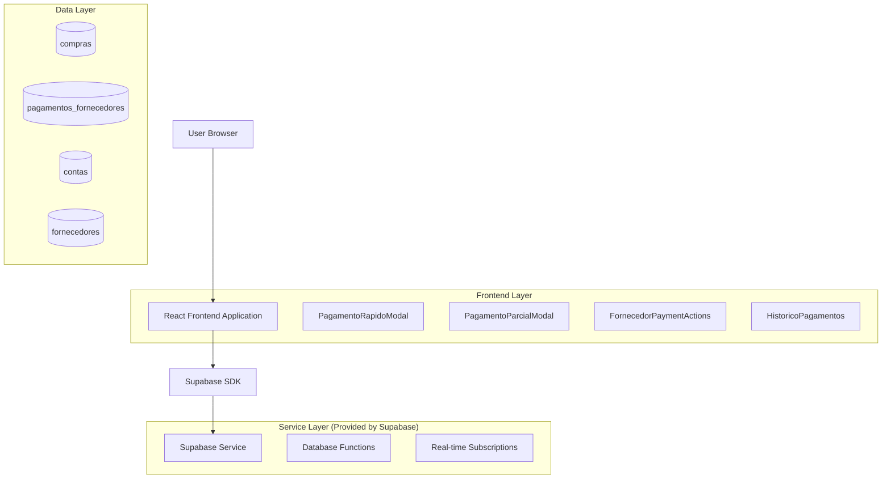
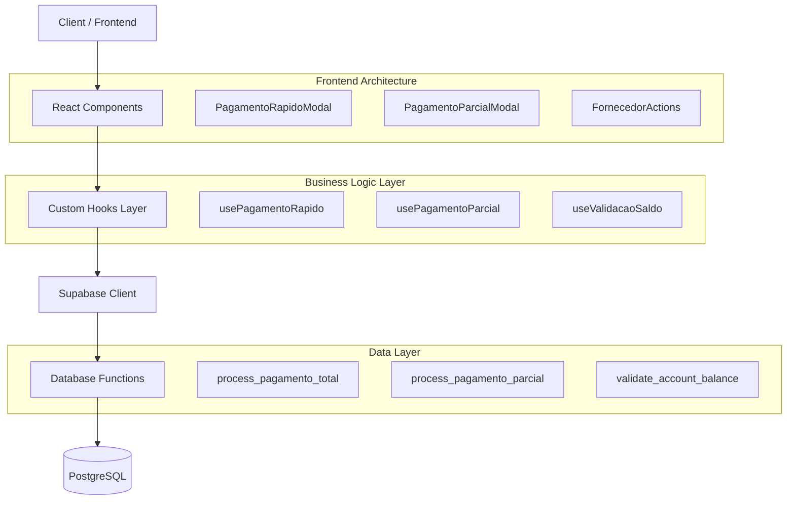
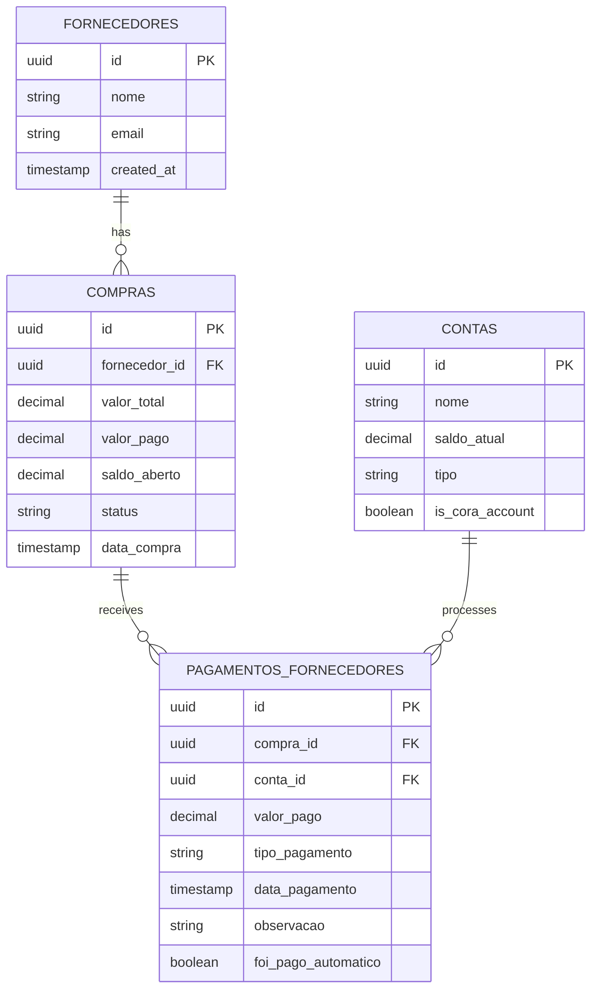

# Arquitetura Técnica - Sistema de Pagamentos de Fornecedores Otimizado

## 1. Architecture design



## 2. Technology Description

- Frontend: React@18 + TypeScript + Tailwind CSS@3 + Vite
- Backend: Supabase (PostgreSQL + Real-time + Auth)
- UI Components: shadcn/ui + Lucide React
- Form Management: React Hook Form + Zod
- State Management: React Query + Zustand (local state)

## 3. Route definitions

| Route | Purpose |
|-------|---------|
| /fornecedores | Lista de fornecedores com saldos em aberto e ações de pagamento |
| /fornecedores/:id | Detalhes do fornecedor com histórico completo de pagamentos |
| /pagamentos | Histórico geral de todos os pagamentos realizados |
| /contas | Gerenciamento de contas bancárias (incluindo saldo da Cora) |

## 4. API definitions

### 4.1 Core API

**Pagamento Total Automático**
```typescript
// Hook personalizado
const usePagamentoRapido = () => {
  const pagarTotal = async (compraId: string, foiPago: boolean) => {
    // Lógica de pagamento total com desconto automático da Cora
  }
}
```

**Pagamento Parcial**
```typescript
// Hook personalizado  
const usePagamentoParcial = () => {
  const pagarParcial = async (compraId: string, valor: number, contaId: string) => {
    // Lógica de pagamento parcial customizado
  }
}
```

**Validação de Saldo**
```typescript
interface ValidacaoSaldo {
  contaId: string;
  valorSolicitado: number;
  saldoDisponivel: number;
  podeProcessar: boolean;
}
```

**Histórico de Pagamentos**
```typescript
interface HistoricoPagamento {
  id: string;
  compraId: string;
  fornecedorNome: string;
  valorPago: number;
  contaUtilizada: string;
  dataPagamento: Date;
  tipoPagamento: 'total' | 'parcial';
  saldoRestante: number;
  observacao?: string;
}
```

## 5. Server architecture diagram



## 6. Data model

### 6.1 Data model definition



### 6.2 Data Definition Language

**Tabela de Pagamentos Otimizada**
```sql
-- Adicionar colunas para otimização
ALTER TABLE pagamentos_fornecedores 
ADD COLUMN tipo_pagamento VARCHAR(20) DEFAULT 'parcial' CHECK (tipo_pagamento IN ('total', 'parcial')),
ADD COLUMN foi_pago_automatico BOOLEAN DEFAULT FALSE,
ADD COLUMN saldo_anterior DECIMAL(10,2),
ADD COLUMN saldo_posterior DECIMAL(10,2);

-- Índices para performance
CREATE INDEX idx_pagamentos_fornecedores_tipo ON pagamentos_fornecedores(tipo_pagamento);
CREATE INDEX idx_pagamentos_fornecedores_data ON pagamentos_fornecedores(data_pagamento DESC);
CREATE INDEX idx_compras_saldo_aberto ON compras(saldo_aberto) WHERE saldo_aberto > 0;

-- Função para pagamento total automático
CREATE OR REPLACE FUNCTION process_pagamento_total(
    p_compra_id UUID,
    p_foi_pago BOOLEAN DEFAULT TRUE
) RETURNS JSON AS $$
DECLARE
    v_compra RECORD;
    v_conta_cora RECORD;
    v_pagamento_id UUID;
    v_result JSON;
BEGIN
    -- Buscar dados da compra
    SELECT * INTO v_compra FROM compras WHERE id = p_compra_id;
    
    IF NOT FOUND THEN
        RETURN json_build_object('success', false, 'error', 'Compra não encontrada');
    END IF;
    
    -- Buscar conta Cora
    SELECT * INTO v_conta_cora FROM contas WHERE is_cora_account = true LIMIT 1;
    
    IF NOT FOUND THEN
        RETURN json_build_object('success', false, 'error', 'Conta Cora não encontrada');
    END IF;
    
    -- Validar saldo suficiente
    IF v_conta_cora.saldo_atual < v_compra.saldo_aberto THEN
        RETURN json_build_object(
            'success', false, 
            'error', 'Saldo insuficiente na conta Cora',
            'saldo_disponivel', v_conta_cora.saldo_atual,
            'valor_necessario', v_compra.saldo_aberto
        );
    END IF;
    
    -- Processar pagamento
    INSERT INTO pagamentos_fornecedores (
        compra_id, conta_id, valor_pago, tipo_pagamento, 
        foi_pago_automatico, saldo_anterior, saldo_posterior,
        data_pagamento, observacao
    ) VALUES (
        p_compra_id, v_conta_cora.id, v_compra.saldo_aberto, 'total',
        p_foi_pago, v_compra.saldo_aberto, 0,
        NOW(), 'Pagamento total automático via Cora'
    ) RETURNING id INTO v_pagamento_id;
    
    -- Atualizar saldo da compra
    UPDATE compras 
    SET valor_pago = valor_total, saldo_aberto = 0, status = 'pago'
    WHERE id = p_compra_id;
    
    -- Atualizar saldo da conta
    UPDATE contas 
    SET saldo_atual = saldo_atual - v_compra.saldo_aberto
    WHERE id = v_conta_cora.id;
    
    RETURN json_build_object(
        'success', true,
        'pagamento_id', v_pagamento_id,
        'valor_pago', v_compra.saldo_aberto,
        'novo_saldo_conta', v_conta_cora.saldo_atual - v_compra.saldo_aberto
    );
END;
$$ LANGUAGE plpgsql;

-- Função para pagamento parcial
CREATE OR REPLACE FUNCTION process_pagamento_parcial(
    p_compra_id UUID,
    p_conta_id UUID,
    p_valor_pago DECIMAL,
    p_observacao TEXT DEFAULT NULL
) RETURNS JSON AS $$
DECLARE
    v_compra RECORD;
    v_conta RECORD;
    v_pagamento_id UUID;
    v_novo_saldo_aberto DECIMAL;
BEGIN
    -- Buscar dados da compra
    SELECT * INTO v_compra FROM compras WHERE id = p_compra_id;
    
    IF NOT FOUND THEN
        RETURN json_build_object('success', false, 'error', 'Compra não encontrada');
    END IF;
    
    -- Buscar conta
    SELECT * INTO v_conta FROM contas WHERE id = p_conta_id;
    
    IF NOT FOUND THEN
        RETURN json_build_object('success', false, 'error', 'Conta não encontrada');
    END IF;
    
    -- Validações
    IF p_valor_pago <= 0 THEN
        RETURN json_build_object('success', false, 'error', 'Valor deve ser maior que zero');
    END IF;
    
    IF p_valor_pago > v_compra.saldo_aberto THEN
        RETURN json_build_object('success', false, 'error', 'Valor maior que saldo aberto');
    END IF;
    
    IF v_conta.saldo_atual < p_valor_pago THEN
        RETURN json_build_object('success', false, 'error', 'Saldo insuficiente na conta');
    END IF;
    
    -- Calcular novo saldo
    v_novo_saldo_aberto := v_compra.saldo_aberto - p_valor_pago;
    
    -- Processar pagamento
    INSERT INTO pagamentos_fornecedores (
        compra_id, conta_id, valor_pago, tipo_pagamento,
        saldo_anterior, saldo_posterior, data_pagamento, observacao
    ) VALUES (
        p_compra_id, p_conta_id, p_valor_pago, 'parcial',
        v_compra.saldo_aberto, v_novo_saldo_aberto, NOW(), p_observacao
    ) RETURNING id INTO v_pagamento_id;
    
    -- Atualizar compra
    UPDATE compras 
    SET 
        valor_pago = valor_pago + p_valor_pago,
        saldo_aberto = v_novo_saldo_aberto,
        status = CASE WHEN v_novo_saldo_aberto = 0 THEN 'pago' ELSE 'parcial' END
    WHERE id = p_compra_id;
    
    -- Atualizar conta
    UPDATE contas 
    SET saldo_atual = saldo_atual - p_valor_pago
    WHERE id = p_conta_id;
    
    RETURN json_build_object(
        'success', true,
        'pagamento_id', v_pagamento_id,
        'valor_pago', p_valor_pago,
        'saldo_restante', v_novo_saldo_aberto,
        'status_compra', CASE WHEN v_novo_saldo_aberto = 0 THEN 'pago' ELSE 'parcial' END
    );
END;
$$ LANGUAGE plpgsql;

-- Permissões Supabase
GRANT SELECT ON pagamentos_fornecedores TO anon;
GRANT ALL PRIVILEGES ON pagamentos_fornecedores TO authenticated;
GRANT EXECUTE ON FUNCTION process_pagamento_total TO authenticated;
GRANT EXECUTE ON FUNCTION process_pagamento_parcial TO authenticated;
```