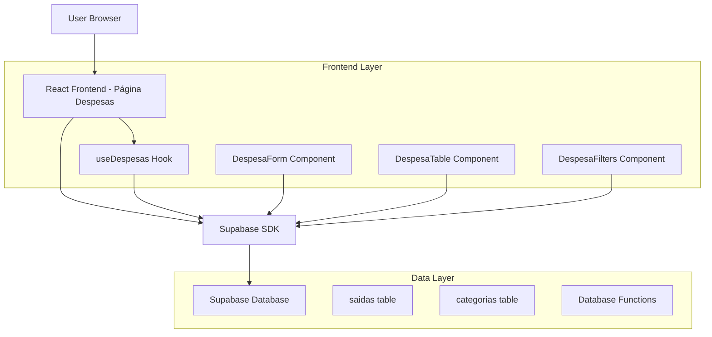
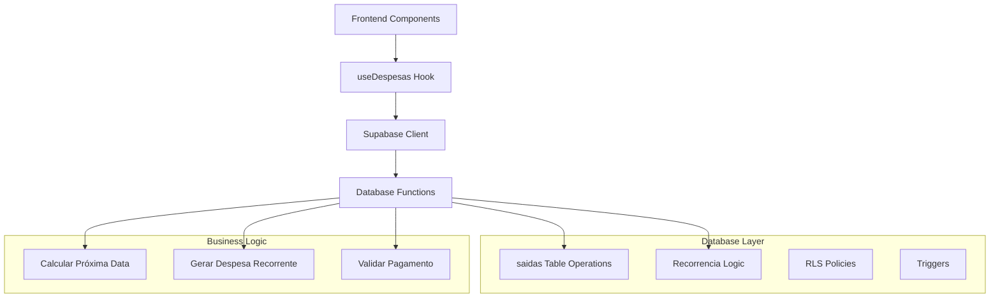
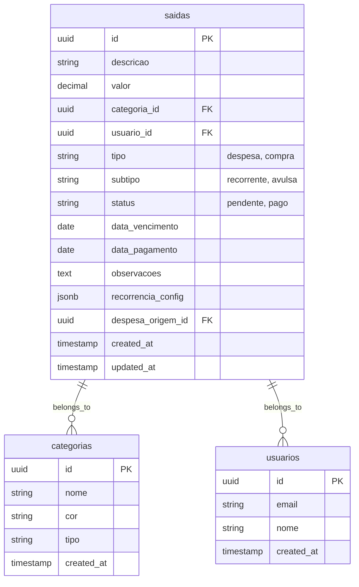

# Arquitetura Técnica - Sistema de Gestão de Despesas

## 1. Architecture design



## 2. Technology Description

- Frontend: React@18 + TypeScript + Tailwind CSS + Vite
- Backend: Supabase (PostgreSQL + Auth + Real-time)
- State Management: React Hooks + Context API
- UI Components: Shadcn/ui + Lucide React Icons
- Forms: React Hook Form + Zod validation
- Date Handling: date-fns

## 3. Route definitions

| Route | Purpose |
|-------|---------|
| /despesas | Página principal de gestão de despesas com listagem, filtros e ações |
| /despesas?modal=create | Página de despesas com modal de criação aberto |
| /despesas?modal=edit&id={id} | Página de despesas com modal de edição aberto |

## 4. API definitions

### 4.1 Core API

**Listar Despesas**
```typescript
// Hook: useDespesas()
const { despesas, loading, error, refetch } = useDespesas(filters?)

interface DespesaFilters {
  status?: 'pendente' | 'pago' | 'vencido'
  tipo?: 'recorrente' | 'avulsa'
  categoria_id?: string
  data_inicio?: string
  data_fim?: string
  busca?: string
}
```

**Criar Despesa**
```typescript
// Hook: useDespesas()
const { createDespesa } = useDespesas()

interface CreateDespesaData {
  descricao: string
  valor: number
  categoria_id: string
  tipo: 'recorrente' | 'avulsa'
  data_vencimento: string
  observacoes?: string
  recorrencia?: {
    frequencia: 'mensal' | 'bimestral' | 'trimestral' | 'semestral' | 'anual'
    proxima_data: string
  }
}
```

**Marcar como Pago**
```typescript
// Hook: useDespesas()
const { marcarComoPago } = useDespesas()

interface PagarDespesaData {
  id: string
  data_pagamento: string
  valor_pago?: number // opcional, padrão é o valor original
}
```

**Atualizar Despesa**
```typescript
// Hook: useDespesas()
const { updateDespesa } = useDespesas()

interface UpdateDespesaData extends Partial<CreateDespesaData> {
  id: string
}
```

## 5. Server architecture diagram



## 6. Data model

### 6.1 Data model definition



### 6.2 Data Definition Language

**Atualizar tabela saidas para suportar despesas**
```sql
-- Adicionar colunas específicas para despesas
ALTER TABLE saidas 
ADD COLUMN IF NOT EXISTS subtipo VARCHAR(20) CHECK (subtipo IN ('recorrente', 'avulsa')),
ADD COLUMN IF NOT EXISTS status VARCHAR(20) DEFAULT 'pendente' CHECK (status IN ('pendente', 'pago', 'vencido')),
ADD COLUMN IF NOT EXISTS data_vencimento DATE,
ADD COLUMN IF NOT EXISTS data_pagamento DATE,
ADD COLUMN IF NOT EXISTS observacoes TEXT,
ADD COLUMN IF NOT EXISTS recorrencia_config JSONB,
ADD COLUMN IF NOT EXISTS despesa_origem_id UUID REFERENCES saidas(id);

-- Índices para performance
CREATE INDEX IF NOT EXISTS idx_saidas_tipo_subtipo ON saidas(tipo, subtipo);
CREATE INDEX IF NOT EXISTS idx_saidas_status ON saidas(status);
CREATE INDEX IF NOT EXISTS idx_saidas_data_vencimento ON saidas(data_vencimento);
CREATE INDEX IF NOT EXISTS idx_saidas_despesa_origem ON saidas(despesa_origem_id);

-- Função para calcular próxima data de recorrência
CREATE OR REPLACE FUNCTION calcular_proxima_data_recorrencia(
    data_base DATE,
    frequencia TEXT
) RETURNS DATE AS $$
BEGIN
    CASE frequencia
        WHEN 'mensal' THEN
            RETURN data_base + INTERVAL '1 month';
        WHEN 'bimestral' THEN
            RETURN data_base + INTERVAL '2 months';
        WHEN 'trimestral' THEN
            RETURN data_base + INTERVAL '3 months';
        WHEN 'semestral' THEN
            RETURN data_base + INTERVAL '6 months';
        WHEN 'anual' THEN
            RETURN data_base + INTERVAL '1 year';
        ELSE
            RETURN data_base + INTERVAL '1 month';
    END CASE;
END;
$$ LANGUAGE plpgsql;

-- Função para gerar próxima despesa recorrente
CREATE OR REPLACE FUNCTION gerar_proxima_despesa_recorrente()
RETURNS TRIGGER AS $$
BEGIN
    -- Só gera se for despesa recorrente que foi paga
    IF NEW.tipo = 'despesa' 
       AND NEW.subtipo = 'recorrente' 
       AND NEW.status = 'pago' 
       AND OLD.status != 'pago' THEN
        
        INSERT INTO saidas (
            descricao,
            valor,
            categoria_id,
            usuario_id,
            tipo,
            subtipo,
            status,
            data_vencimento,
            observacoes,
            recorrencia_config,
            despesa_origem_id
        ) VALUES (
            NEW.descricao,
            NEW.valor,
            NEW.categoria_id,
            NEW.usuario_id,
            'despesa',
            'recorrente',
            'pendente',
            calcular_proxima_data_recorrencia(
                NEW.data_vencimento,
                (NEW.recorrencia_config->>'frequencia')::TEXT
            ),
            NEW.observacoes,
            NEW.recorrencia_config,
            COALESCE(NEW.despesa_origem_id, NEW.id)
        );
    END IF;
    
    RETURN NEW;
END;
$$ LANGUAGE plpgsql;

-- Trigger para gerar despesas recorrentes
DROP TRIGGER IF EXISTS trigger_gerar_despesa_recorrente ON saidas;
CREATE TRIGGER trigger_gerar_despesa_recorrente
    AFTER UPDATE ON saidas
    FOR EACH ROW
    EXECUTE FUNCTION gerar_proxima_despesa_recorrente();

-- Função para atualizar status de despesas vencidas
CREATE OR REPLACE FUNCTION atualizar_status_despesas_vencidas()
RETURNS void AS $$
BEGIN
    UPDATE saidas 
    SET status = 'vencido'
    WHERE tipo = 'despesa' 
      AND status = 'pendente' 
      AND data_vencimento < CURRENT_DATE;
END;
$$ LANGUAGE plpgsql;

-- View para despesas com informações calculadas
CREATE OR REPLACE VIEW view_despesas AS
SELECT 
    s.*,
    c.nome as categoria_nome,
    c.cor as categoria_cor,
    CASE 
        WHEN s.status = 'pendente' AND s.data_vencimento < CURRENT_DATE THEN 'vencido'
        ELSE s.status
    END as status_calculado,
    CASE 
        WHEN s.subtipo = 'recorrente' THEN
            calcular_proxima_data_recorrencia(s.data_vencimento, (s.recorrencia_config->>'frequencia')::TEXT)
        ELSE NULL
    END as proxima_data_calculada
FROM saidas s
LEFT JOIN categorias c ON s.categoria_id = c.id
WHERE s.tipo = 'despesa';

-- RLS Policies para despesas
ALTER TABLE saidas ENABLE ROW LEVEL SECURITY;

-- Policy para visualizar despesas do usuário
CREATE POLICY "Usuários podem ver suas próprias despesas" ON saidas
    FOR SELECT USING (usuario_id = auth.uid() AND tipo = 'despesa');

-- Policy para inserir despesas
CREATE POLICY "Usuários podem criar suas próprias despesas" ON saidas
    FOR INSERT WITH CHECK (usuario_id = auth.uid() AND tipo = 'despesa');

-- Policy para atualizar despesas
CREATE POLICY "Usuários podem atualizar suas próprias despesas" ON saidas
    FOR UPDATE USING (usuario_id = auth.uid() AND tipo = 'despesa');

-- Policy para deletar despesas
CREATE POLICY "Usuários podem deletar suas próprias despesas" ON saidas
    FOR DELETE USING (usuario_id = auth.uid() AND tipo = 'despesa');

-- Inserir categorias padrão para despesas
INSERT INTO categorias (nome, cor, tipo) VALUES
('Moradia', '#EF4444', 'despesa'),
('Alimentação', '#F59E0B', 'despesa'),
('Transporte', '#3B82F6', 'despesa'),
('Saúde', '#10B981', 'despesa'),
('Educação', '#8B5CF6', 'despesa'),
('Lazer', '#F97316', 'despesa'),
('Serviços', '#6B7280', 'despesa'),
('Outros', '#374151', 'despesa')
ON CONFLICT (nome) DO NOTHING;
```