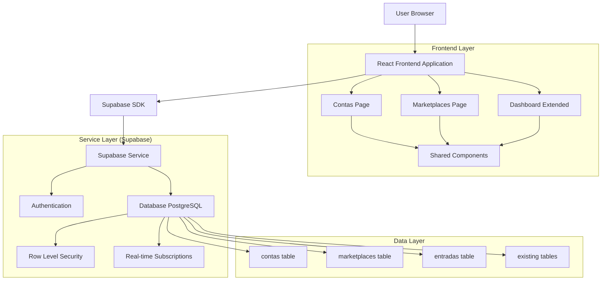
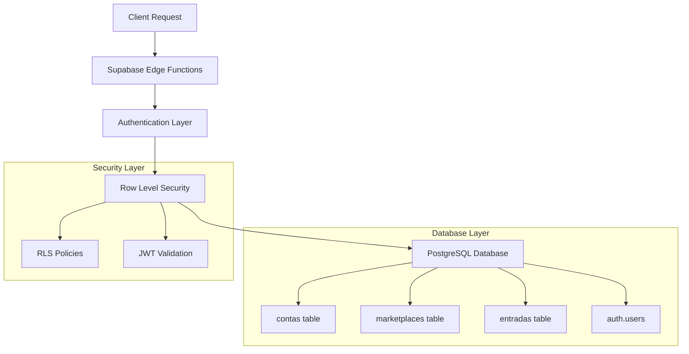
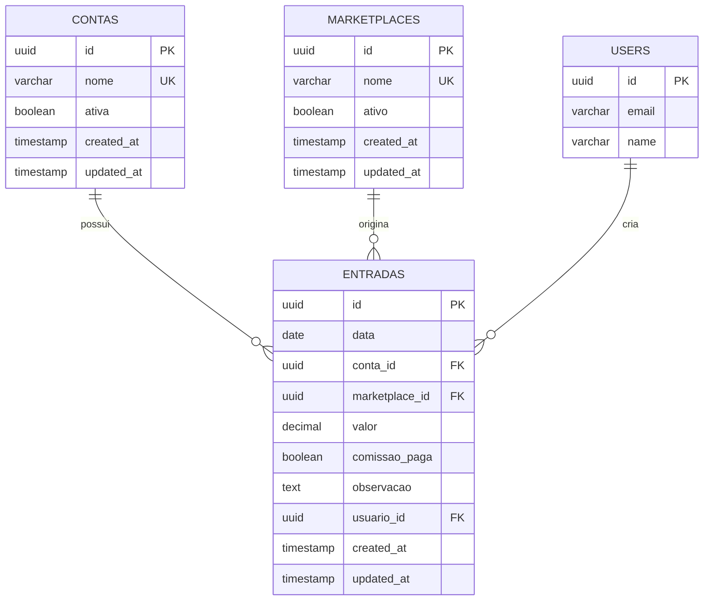

# Arquitetura Técnica - Sistema de Entradas de Marketplace
## Financeiro DEBAJEYU - Extensão v2.0

## 1. Arquitetura do Sistema



## 2. Stack Tecnológico

### 2.1 Frontend
- **React@18** - Framework principal
- **TypeScript** - Tipagem estática
- **Tailwind CSS@3** - Estilização
- **Vite** - Build tool e dev server
- **React Hook Form** - Gerenciamento de formulários
- **React Query/TanStack Query** - Cache e sincronização de dados
- **React Router DOM** - Roteamento
- **React Hot Toast** - Notificações
- **Date-fns** - Manipulação de datas
- **React Input Mask** - Máscaras de input

### 2.2 Backend
- **Supabase** - Backend as a Service
- **PostgreSQL** - Banco de dados relacional
- **Row Level Security (RLS)** - Controle de acesso
- **Supabase Auth** - Autenticação
- **Supabase Realtime** - Atualizações em tempo real

### 2.3 Ferramentas de Desenvolvimento
- **ESLint** - Linting
- **Prettier** - Formatação de código
- **TypeScript** - Verificação de tipos

## 3. Definições de Rotas

| Rota | Propósito | Componente |
|------|-----------|------------|
| `/dashboard` | Dashboard principal com cards existentes + novos cards de entradas | `Dashboard.tsx` |
| `/investimentos` | Página de investimentos (existente, não alterada) | `Investimentos.tsx` |
| `/contas` | Gerenciamento de contas e entradas | `Contas.tsx` |
| `/marketplaces` | Listagem e detalhes de marketplaces | `Marketplaces.tsx` |
| `/marketplaces/:id` | Detalhes específicos de um marketplace | `MarketplaceDetails.tsx` |
| `/socios` | Página de sócios (existente, não alterada) | `Socios.tsx` |
| `/login` | Página de login (existente) | `Login.tsx` |

## 4. Definições de API

### 4.1 Entradas (Core API)

#### Listar Entradas
```typescript
// Supabase Query
const { data, error } = await supabase
  .from('entradas')
  .select(`
    *,
    conta:contas(nome),
    marketplace:marketplaces(nome),
    usuario:auth.users(email)
  `)
  .order('data', { ascending: false });
```

#### Criar Entrada
```typescript
// Supabase Insert
const { data, error } = await supabase
  .from('entradas')
  .insert({
    data: string,           // YYYY-MM-DD
    conta_id: string,       // UUID
    marketplace_id: string, // UUID
    valor: number,          // Decimal
    comissao_paga: boolean, // Default false
    observacao?: string,    // Optional
    usuario_id: string      // Auto from auth
  });
```

#### Atualizar Entrada
```typescript
// Supabase Update (apenas autor)
const { data, error } = await supabase
  .from('entradas')
  .update({
    data?: string,
    marketplace_id?: string,
    valor?: number,
    comissao_paga?: boolean,
    observacao?: string,
    updated_at: new Date().toISOString()
  })
  .eq('id', entradaId)
  .eq('usuario_id', currentUserId); // RLS enforcement
```

#### Excluir Entrada
```typescript
// Supabase Delete (apenas autor)
const { error } = await supabase
  .from('entradas')
  .delete()
  .eq('id', entradaId)
  .eq('usuario_id', currentUserId); // RLS enforcement
```

### 4.2 Contas API

#### Listar Contas
```typescript
const { data, error } = await supabase
  .from('contas')
  .select('*')
  .eq('ativa', true)
  .order('nome');
```

#### Totais por Conta
```typescript
const { data, error } = await supabase
  .from('entradas')
  .select('valor')
  .eq('conta_id', contaId);

// Cálculo no frontend
const total = data?.reduce((sum, entrada) => sum + entrada.valor, 0) || 0;
```

### 4.3 Marketplaces API

#### Listar Marketplaces
```typescript
const { data, error } = await supabase
  .from('marketplaces')
  .select('*')
  .eq('ativo', true)
  .order('nome');
```

#### Criar Marketplace
```typescript
const { data, error } = await supabase
  .from('marketplaces')
  .insert({
    nome: string
  });
```

#### Totais por Marketplace
```typescript
const { data, error } = await supabase
  .from('entradas')
  .select('valor, comissao_paga')
  .eq('marketplace_id', marketplaceId);

// Cálculos no frontend
const totalEnviado = data?.reduce((sum, entrada) => sum + entrada.valor, 0) || 0;
const totalComissao = data?.reduce((sum, entrada) => 
  entrada.comissao_paga ? sum + (entrada.valor * 0.04) : sum, 0) || 0;
```

## 5. Arquitetura do Servidor (Supabase)



## 6. Modelo de Dados

### 6.1 Diagrama Entidade-Relacionamento



### 6.2 DDL (Data Definition Language)

#### Tabela: contas
```sql
-- Criar tabela contas
CREATE TABLE contas (
    id UUID PRIMARY KEY DEFAULT gen_random_uuid(),
    nome VARCHAR(100) NOT NULL UNIQUE,
    ativa BOOLEAN DEFAULT true,
    created_at TIMESTAMP WITH TIME ZONE DEFAULT NOW(),
    updated_at TIMESTAMP WITH TIME ZONE DEFAULT NOW()
);

-- Índices
CREATE INDEX idx_contas_ativa ON contas(ativa);
CREATE INDEX idx_contas_nome ON contas(nome);

-- RLS Policies
ALTER TABLE contas ENABLE ROW LEVEL SECURITY;

-- Política de leitura: usuários autenticados
CREATE POLICY "Usuários autenticados podem ler contas" ON contas
    FOR SELECT USING (auth.role() = 'authenticated');

-- Política de inserção: usuários autenticados
CREATE POLICY "Usuários autenticados podem criar contas" ON contas
    FOR INSERT WITH CHECK (auth.role() = 'authenticated');

-- Dados iniciais
INSERT INTO contas (nome) VALUES ('Cora');
```

#### Tabela: marketplaces
```sql
-- Criar tabela marketplaces
CREATE TABLE marketplaces (
    id UUID PRIMARY KEY DEFAULT gen_random_uuid(),
    nome VARCHAR(100) NOT NULL UNIQUE,
    ativo BOOLEAN DEFAULT true,
    created_at TIMESTAMP WITH TIME ZONE DEFAULT NOW(),
    updated_at TIMESTAMP WITH TIME ZONE DEFAULT NOW()
);

-- Índices
CREATE INDEX idx_marketplaces_ativo ON marketplaces(ativo);
CREATE INDEX idx_marketplaces_nome ON marketplaces(nome);

-- RLS Policies
ALTER TABLE marketplaces ENABLE ROW LEVEL SECURITY;

-- Política de leitura: usuários autenticados
CREATE POLICY "Usuários autenticados podem ler marketplaces" ON marketplaces
    FOR SELECT USING (auth.role() = 'authenticated');

-- Política de inserção: usuários autenticados
CREATE POLICY "Usuários autenticados podem criar marketplaces" ON marketplaces
    FOR INSERT WITH CHECK (auth.role() = 'authenticated');

-- Política de atualização: usuários autenticados
CREATE POLICY "Usuários autenticados podem atualizar marketplaces" ON marketplaces
    FOR UPDATE USING (auth.role() = 'authenticated');
```

#### Tabela: entradas
```sql
-- Criar tabela entradas
CREATE TABLE entradas (
    id UUID PRIMARY KEY DEFAULT gen_random_uuid(),
    data DATE NOT NULL,
    conta_id UUID NOT NULL REFERENCES contas(id) ON DELETE RESTRICT,
    marketplace_id UUID NOT NULL REFERENCES marketplaces(id) ON DELETE RESTRICT,
    valor DECIMAL(10,2) NOT NULL CHECK (valor > 0),
    comissao_paga BOOLEAN DEFAULT false,
    observacao TEXT,
    usuario_id UUID NOT NULL REFERENCES auth.users(id) ON DELETE RESTRICT,
    created_at TIMESTAMP WITH TIME ZONE DEFAULT NOW(),
    updated_at TIMESTAMP WITH TIME ZONE DEFAULT NOW()
);

-- Índices para performance
CREATE INDEX idx_entradas_data ON entradas(data DESC);
CREATE INDEX idx_entradas_conta_id ON entradas(conta_id);
CREATE INDEX idx_entradas_marketplace_id ON entradas(marketplace_id);
CREATE INDEX idx_entradas_usuario_id ON entradas(usuario_id);
CREATE INDEX idx_entradas_created_at ON entradas(created_at DESC);

-- Índice composto para filtros comuns
CREATE INDEX idx_entradas_conta_marketplace ON entradas(conta_id, marketplace_id);
CREATE INDEX idx_entradas_data_marketplace ON entradas(data, marketplace_id);

-- RLS Policies
ALTER TABLE entradas ENABLE ROW LEVEL SECURITY;

-- Política de leitura: usuários autenticados
CREATE POLICY "Usuários autenticados podem ler entradas" ON entradas
    FOR SELECT USING (auth.role() = 'authenticated');

-- Política de inserção: usuários autenticados
CREATE POLICY "Usuários autenticados podem criar entradas" ON entradas
    FOR INSERT WITH CHECK (
        auth.role() = 'authenticated' AND 
        usuario_id = auth.uid()
    );

-- Política de atualização: apenas o autor
CREATE POLICY "Usuários podem atualizar suas próprias entradas" ON entradas
    FOR UPDATE USING (
        auth.role() = 'authenticated' AND 
        usuario_id = auth.uid()
    );

-- Política de exclusão: apenas o autor
CREATE POLICY "Usuários podem excluir suas próprias entradas" ON entradas
    FOR DELETE USING (
        auth.role() = 'authenticated' AND 
        usuario_id = auth.uid()
    );
```

#### Trigger para updated_at
```sql
-- Função para atualizar updated_at
CREATE OR REPLACE FUNCTION update_updated_at_column()
RETURNS TRIGGER AS $$
BEGIN
    NEW.updated_at = NOW();
    RETURN NEW;
END;
$$ language 'plpgsql';

-- Triggers para todas as tabelas
CREATE TRIGGER update_contas_updated_at 
    BEFORE UPDATE ON contas 
    FOR EACH ROW EXECUTE FUNCTION update_updated_at_column();

CREATE TRIGGER update_marketplaces_updated_at 
    BEFORE UPDATE ON marketplaces 
    FOR EACH ROW EXECUTE FUNCTION update_updated_at_column();

CREATE TRIGGER update_entradas_updated_at 
    BEFORE UPDATE ON entradas 
    FOR EACH ROW EXECUTE FUNCTION update_updated_at_column();
```

## 7. Tipos TypeScript

### 7.1 Interfaces Principais

```typescript
// Tipos base
export interface Conta {
  id: string;
  nome: string;
  ativa: boolean;
  created_at: string;
  updated_at: string;
}

export interface Marketplace {
  id: string;
  nome: string;
  ativo: boolean;
  created_at: string;
  updated_at: string;
}

export interface Entrada {
  id: string;
  data: string; // YYYY-MM-DD
  conta_id: string;
  marketplace_id: string;
  valor: number;
  comissao_paga: boolean;
  observacao?: string;
  usuario_id: string;
  created_at: string;
  updated_at: string;
  
  // Relacionamentos (quando incluídos na query)
  conta?: Conta;
  marketplace?: Marketplace;
  usuario?: {
    email: string;
  };
}

// Tipos para formulários
export interface NovaEntradaForm {
  data: string;
  conta_id: string;
  marketplace_id: string;
  valor: string; // String para máscara BRL
  comissao_paga: boolean;
  observacao?: string;
}

export interface NovoMarketplaceForm {
  nome: string;
}

// Tipos para filtros
export interface FiltrosEntrada {
  dataInicio?: string;
  dataFim?: string;
  marketplace_id?: string;
  busca?: string;
}

// Tipos para totais
export interface TotaisConta {
  conta_id: string;
  total_recebido: number;
  total_entradas: number;
}

export interface TotaisMarketplace {
  marketplace_id: string;
  total_enviado: number;
  total_comissao: number;
  total_marketplace: number;
  total_entradas: number;
}

export interface TotaisDashboard {
  total_cora: number;
  total_comissao: number;
}
```

### 7.2 Hooks Customizados

```typescript
// Hook para entradas
export interface UseEntradasOptions {
  conta_id?: string;
  marketplace_id?: string;
  filtros?: FiltrosEntrada;
}

export interface UseEntradasReturn {
  entradas: Entrada[];
  loading: boolean;
  error: Error | null;
  refetch: () => void;
  createEntrada: (entrada: NovaEntradaForm) => Promise<void>;
  updateEntrada: (id: string, entrada: Partial<NovaEntradaForm>) => Promise<void>;
  deleteEntrada: (id: string) => Promise<void>;
}

// Hook para totais
export interface UseTotaisReturn {
  totaisConta: TotaisConta[];
  totaisMarketplace: TotaisMarketplace[];
  totaisDashboard: TotaisDashboard;
  loading: boolean;
  error: Error | null;
  refetch: () => void;
}
```

## 8. Componentes Frontend

### 8.1 Estrutura de Componentes

```
src/
├── components/
│   ├── ui/
│   │   ├── Button.tsx
│   │   ├── Input.tsx
│   │   ├── Select.tsx
│   │   ├── Modal.tsx
│   │   ├── Card.tsx
│   │   └── Table.tsx
│   ├── entradas/
│   │   ├── EntradaForm.tsx
│   │   ├── EntradaTable.tsx
│   │   ├── EntradaFilters.tsx
│   │   └── EntradaModal.tsx
│   ├── marketplaces/
│   │   ├── MarketplaceCard.tsx
│   │   ├── MarketplaceForm.tsx
│   │   └── MarketplaceTotals.tsx
│   └── dashboard/
│       ├── TotalCard.tsx
│       └── DashboardStats.tsx
├── pages/
│   ├── Contas.tsx
│   ├── Marketplaces.tsx
│   ├── MarketplaceDetails.tsx
│   └── Dashboard.tsx (extended)
├── hooks/
│   ├── useEntradas.ts
│   ├── useMarketplaces.ts
│   ├── useTotais.ts
│   └── useAuth.ts (existing)
├── utils/
│   ├── formatters.ts
│   ├── validators.ts
│   └── supabase.ts (existing)
└── types/
    └── database.ts
```

## 9. Segurança e Performance

### 9.1 Row Level Security (RLS)
- Todas as tabelas têm RLS habilitado
- Políticas específicas por operação (SELECT, INSERT, UPDATE, DELETE)
- Validação de propriedade para operações de modificação
- Integração com Supabase Auth

### 9.2 Otimizações de Performance
- Índices estratégicos nas colunas de busca
- Paginação para listagens grandes
- Cache de totais com React Query
- Lazy loading de componentes pesados
- Debounce em campos de busca

### 9.3 Validações
- Validação no frontend (React Hook Form + Zod)
- Constraints no banco de dados
- Sanitização de inputs
- Validação de tipos TypeScript

## 10. Estratégia de Deploy

### 10.1 Migração de Banco
```sql
-- Script de migração incremental
-- 1. Criar tabelas
-- 2. Configurar RLS
-- 3. Inserir dados iniciais
-- 4. Criar índices
-- 5. Validar integridade
```

### 10.2 Deploy Frontend
- Build com Vite
- Deploy em Vercel/Netlify
- Variáveis de ambiente para Supabase
- Rollback strategy

### 10.3 Monitoramento
- Logs de erro no frontend
- Métricas de performance
- Monitoramento de queries lentas
- Alertas de falha de autenticação