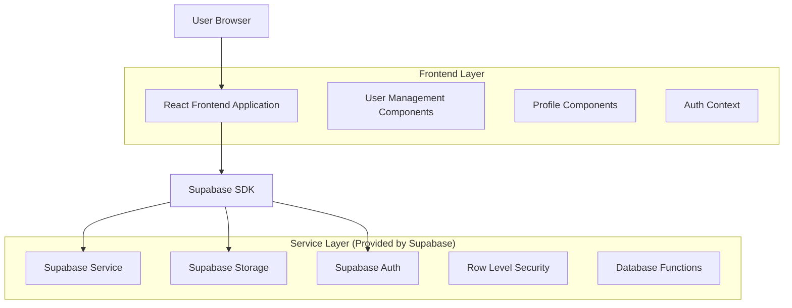
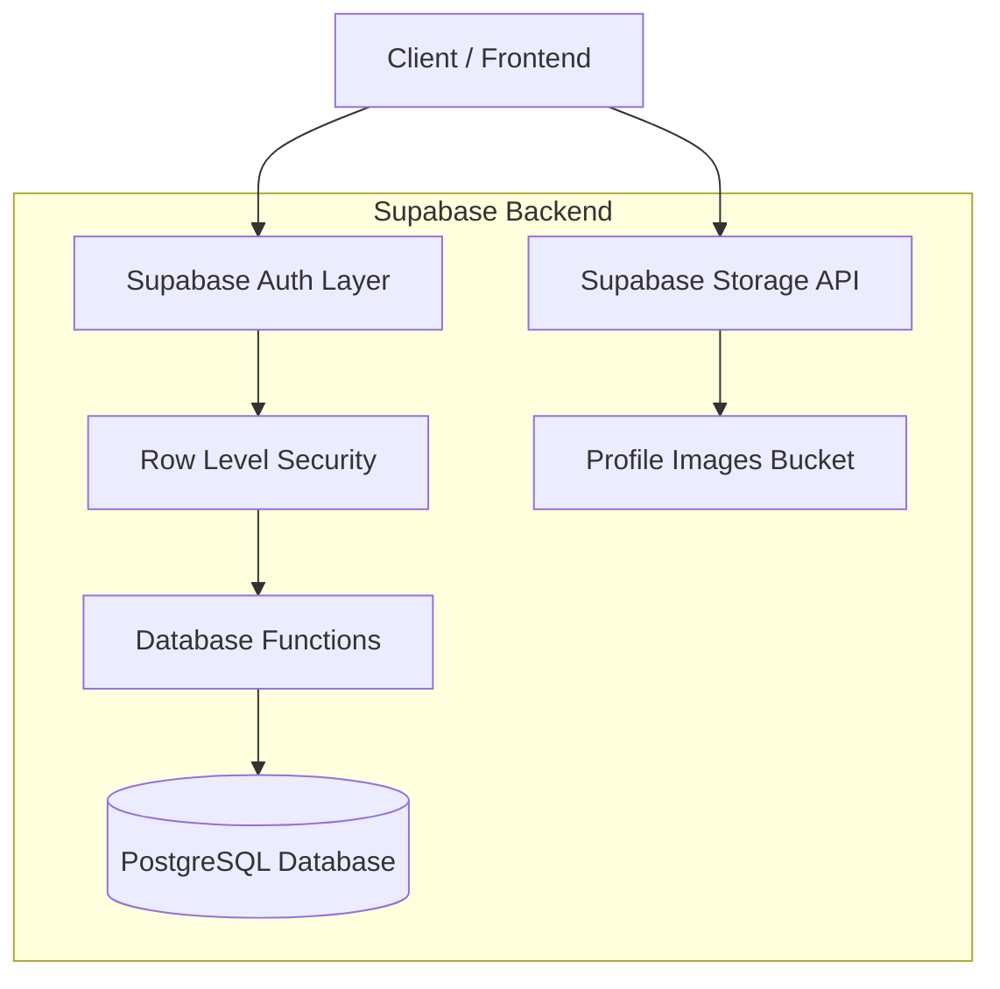
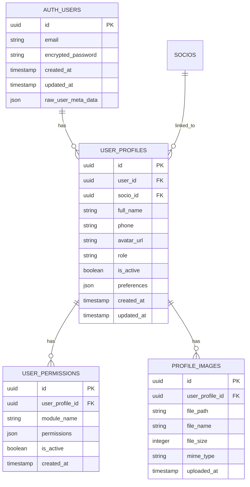

# Sistema de Gestão de Usuários dos Sócios - Arquitetura Técnica

## 1. Architecture design



## 2. Technology Description

- Frontend: React@18 + TypeScript + tailwindcss@3 + vite
- Backend: Supabase (PostgreSQL + Auth + Storage)
- Authentication: Supabase Auth with custom user roles
- File Storage: Supabase Storage for profile images
- State Management: React Context + Custom Hooks

## 3. Route definitions

| Route | Purpose |
|-------|---------|
| /socios | Página de sócios expandida com gestão de usuários |
| /perfil | Página de perfil do usuário logado |
| /perfil/editar | Formulário de edição de dados pessoais |
| /perfil/senha | Formulário de alteração de senha |
| /perfil/foto | Upload e gerenciamento de foto de perfil |
| /admin/usuarios | Painel administrativo de gestão de usuários (admin only) |

## 4. API definitions

### 4.1 Core API

**Gestão de Usuários**
```
POST /rest/v1/rpc/create_socio_user
```

Request:
| Param Name | Param Type | isRequired | Description |
|------------|------------|------------|-------------|
| socio_id | uuid | true | ID do sócio no sistema |
| email | string | true | Email para login |
| password | string | true | Senha temporária |
| role | string | true | Tipo de acesso (socio/socio_limitado) |
| permissions | json | false | Permissões específicas |

Response:
| Param Name | Param Type | Description |
|------------|------------|-------------|
| user_id | uuid | ID do usuário criado |
| success | boolean | Status da operação |
| message | string | Mensagem de retorno |

**Upload de Foto de Perfil**
```
POST /storage/v1/object/profile-images/{user_id}
```

Request: FormData com arquivo de imagem

Response:
| Param Name | Param Type | Description |
|------------|------------|-------------|
| path | string | Caminho da imagem no storage |
| url | string | URL pública da imagem |

**Alteração de Senha**
```
POST /rest/v1/rpc/change_user_password
```

Request:
| Param Name | Param Type | isRequired | Description |
|------------|------------|------------|-------------|
| current_password | string | true | Senha atual |
| new_password | string | true | Nova senha |

Response:
| Param Name | Param Type | Description |
|------------|------------|-------------|
| success | boolean | Status da operação |
| message | string | Mensagem de retorno |

## 5. Server architecture diagram



## 6. Data model

### 6.1 Data model definition



### 6.2 Data Definition Language

**User Profiles Table**
```sql
-- create user_profiles table
CREATE TABLE user_profiles (
    id UUID PRIMARY KEY DEFAULT gen_random_uuid(),
    user_id UUID REFERENCES auth.users(id) ON DELETE CASCADE,
    socio_id UUID REFERENCES socios(id) ON DELETE CASCADE,
    full_name VARCHAR(255) NOT NULL,
    phone VARCHAR(20),
    avatar_url TEXT,
    role VARCHAR(50) DEFAULT 'socio' CHECK (role IN ('admin', 'socio', 'socio_limitado')),
    is_active BOOLEAN DEFAULT true,
    preferences JSONB DEFAULT '{}',
    created_at TIMESTAMP WITH TIME ZONE DEFAULT NOW(),
    updated_at TIMESTAMP WITH TIME ZONE DEFAULT NOW(),
    UNIQUE(user_id),
    UNIQUE(socio_id)
);

-- create user_permissions table
CREATE TABLE user_permissions (
    id UUID PRIMARY KEY DEFAULT gen_random_uuid(),
    user_profile_id UUID REFERENCES user_profiles(id) ON DELETE CASCADE,
    module_name VARCHAR(100) NOT NULL,
    permissions JSONB DEFAULT '{"read": true, "write": false, "delete": false}',
    is_active BOOLEAN DEFAULT true,
    created_at TIMESTAMP WITH TIME ZONE DEFAULT NOW(),
    UNIQUE(user_profile_id, module_name)
);

-- create profile_images table
CREATE TABLE profile_images (
    id UUID PRIMARY KEY DEFAULT gen_random_uuid(),
    user_profile_id UUID REFERENCES user_profiles(id) ON DELETE CASCADE,
    file_path TEXT NOT NULL,
    file_name VARCHAR(255) NOT NULL,
    file_size INTEGER,
    mime_type VARCHAR(100),
    uploaded_at TIMESTAMP WITH TIME ZONE DEFAULT NOW()
);

-- create indexes
CREATE INDEX idx_user_profiles_user_id ON user_profiles(user_id);
CREATE INDEX idx_user_profiles_socio_id ON user_profiles(socio_id);
CREATE INDEX idx_user_permissions_user_profile_id ON user_permissions(user_profile_id);
CREATE INDEX idx_profile_images_user_profile_id ON profile_images(user_profile_id);

-- create updated_at trigger
CREATE OR REPLACE FUNCTION update_updated_at_column()
RETURNS TRIGGER AS $$
BEGIN
    NEW.updated_at = NOW();
    RETURN NEW;
END;
$$ language 'plpgsql';

CREATE TRIGGER update_user_profiles_updated_at 
    BEFORE UPDATE ON user_profiles 
    FOR EACH ROW EXECUTE FUNCTION update_updated_at_column();

-- create RLS policies
ALTER TABLE user_profiles ENABLE ROW LEVEL SECURITY;
ALTER TABLE user_permissions ENABLE ROW LEVEL SECURITY;
ALTER TABLE profile_images ENABLE ROW LEVEL SECURITY;

-- policies for user_profiles
CREATE POLICY "Users can view own profile" ON user_profiles
    FOR SELECT USING (auth.uid() = user_id);

CREATE POLICY "Users can update own profile" ON user_profiles
    FOR UPDATE USING (auth.uid() = user_id);

CREATE POLICY "Admins can manage all profiles" ON user_profiles
    FOR ALL USING (
        EXISTS (
            SELECT 1 FROM user_profiles up 
            WHERE up.user_id = auth.uid() 
            AND up.role = 'admin'
        )
    );

-- grant permissions
GRANT SELECT, INSERT, UPDATE ON user_profiles TO authenticated;
GRANT SELECT, INSERT, UPDATE, DELETE ON user_permissions TO authenticated;
GRANT SELECT, INSERT, DELETE ON profile_images TO authenticated;

-- create storage bucket for profile images
INSERT INTO storage.buckets (id, name, public) 
VALUES ('profile-images', 'profile-images', true);

-- storage policies
CREATE POLICY "Users can upload own profile image" ON storage.objects
    FOR INSERT WITH CHECK (
        bucket_id = 'profile-images' 
        AND auth.uid()::text = (storage.foldername(name))[1]
    );

CREATE POLICY "Users can view profile images" ON storage.objects
    FOR SELECT USING (bucket_id = 'profile-images');

CREATE POLICY "Users can update own profile image" ON storage.objects
    FOR UPDATE USING (
        bucket_id = 'profile-images' 
        AND auth.uid()::text = (storage.foldername(name))[1]
    );

CREATE POLICY "Users can delete own profile image" ON storage.objects
    FOR DELETE USING (
        bucket_id = 'profile-images' 
        AND auth.uid()::text = (storage.foldername(name))[1]
    );

-- create function to create socio user
CREATE OR REPLACE FUNCTION create_socio_user(
    p_socio_id UUID,
    p_email TEXT,
    p_password TEXT,
    p_full_name TEXT,
    p_role TEXT DEFAULT 'socio'
)
RETURNS JSON AS $$
DECLARE
    new_user_id UUID;
    result JSON;
BEGIN
    -- Create user in auth.users (this would typically be done via Supabase Auth API)
    -- For now, we'll return the structure for frontend implementation
    
    result := json_build_object(
        'success', true,
        'message', 'User creation initiated',
        'socio_id', p_socio_id,
        'email', p_email,
        'role', p_role
    );
    
    RETURN result;
EXCEPTION WHEN OTHERS THEN
    RETURN json_build_object(
        'success', false,
        'message', SQLERRM
    );
END;
$$ LANGUAGE plpgsql SECURITY DEFINER;

-- grant execute permission
GRANT EXECUTE ON FUNCTION create_socio_user TO authenticated;
```