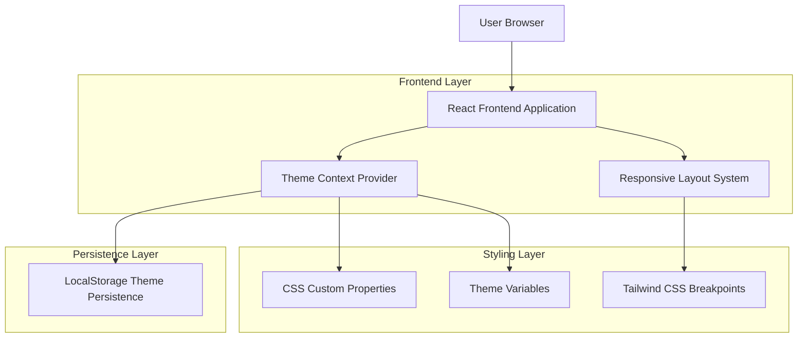
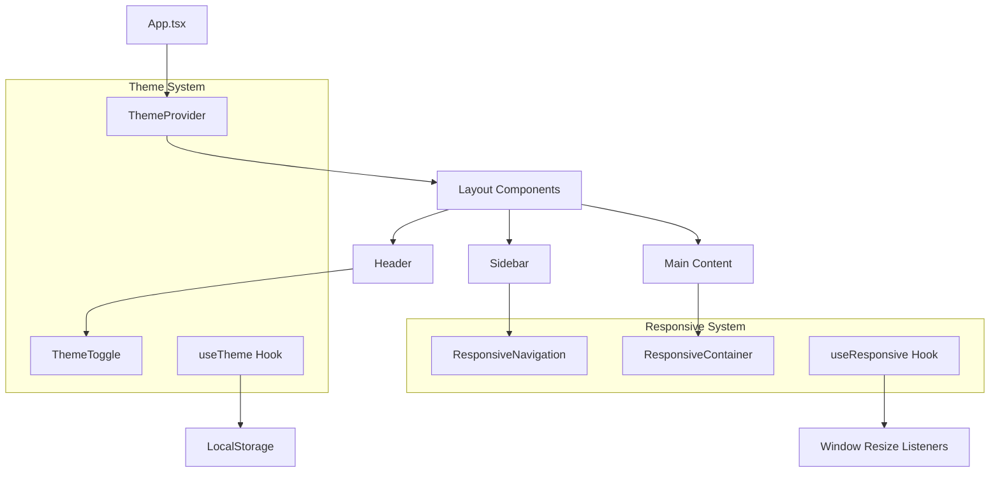

# Arquitetura Técnica - Tema Dark e Responsividade Mobile

## 1. Arquitetura de Design



## 2. Descrição das Tecnologias

- **Frontend**: React@18 + TypeScript + Tailwind CSS@3 + Vite
- **Gerenciamento de Estado**: React Context API + useReducer
- **Persistência**: LocalStorage API
- **Styling**: Tailwind CSS + CSS Custom Properties
- **Responsividade**: Tailwind responsive utilities + CSS Grid/Flexbox

## 3. Definições de Rotas

Todas as rotas existentes mantêm funcionalidade, com adição de:

| Rota | Propósito |
|------|-----------|
| /* (todas) | Aplicação automática do tema selecionado e layout responsivo |
| /settings | Página de configurações com preferências de tema (futura implementação) |

## 4. Definições de Componentes

### 4.1 Novos Componentes

**ThemeToggle Component**
```typescript
interface ThemeToggleProps {
  className?: string;
  size?: 'sm' | 'md' | 'lg';
}

// Funcionalidades:
// - Toggle entre light/dark theme
// - Animação suave de transição
// - Ícones sol/lua dinâmicos
// - Persistência automática
```

**ResponsiveContainer Component**
```typescript
interface ResponsiveContainerProps {
  children: React.ReactNode;
  className?: string;
  maxWidth?: 'sm' | 'md' | 'lg' | 'xl' | '2xl';
}

// Funcionalidades:
// - Container responsivo com breakpoints
// - Padding adaptativo por dispositivo
// - Centralização automática
```

### 4.2 Hooks Atualizados

**useTheme Hook (Expandido)**
```typescript
interface ThemeContextType {
  theme: 'light' | 'dark';
  toggleTheme: () => void;
  setTheme: (theme: 'light' | 'dark') => void;
  systemPreference: 'light' | 'dark';
  isSystemTheme: boolean;
}

// Funcionalidades adicionais:
// - Detecção de preferência do sistema
// - Persistência no localStorage
// - Aplicação automática de classes CSS
// - Listeners para mudanças do sistema
```

**useResponsive Hook (Novo)**
```typescript
interface ResponsiveHook {
  isMobile: boolean;
  isTablet: boolean;
  isDesktop: boolean;
  screenSize: 'mobile' | 'tablet' | 'desktop';
  breakpoint: number;
}

// Funcionalidades:
// - Detecção de breakpoints em tempo real
// - Listeners para resize de tela
// - Utilitários para renderização condicional
```

## 5. Arquitetura de Componentes



## 6. Modelo de Dados

### 6.1 Theme Configuration

```typescript
// Theme Types
type Theme = 'light' | 'dark';

interface ThemeConfig {
  theme: Theme;
  systemPreference: Theme;
  lastUpdated: string;
  autoSync: boolean;
}

// CSS Custom Properties Structure
interface ThemeVariables {
  '--bg-primary': string;
  '--bg-secondary': string;
  '--text-primary': string;
  '--text-secondary': string;
  '--border-color': string;
  '--accent-color': string;
  '--success-color': string;
  '--error-color': string;
  '--warning-color': string;
}
```

### 6.2 Responsive Breakpoints

```typescript
// Breakpoint Configuration
interface BreakpointConfig {
  mobile: {
    min: 320;
    max: 767;
  };
  tablet: {
    min: 768;
    max: 1023;
  };
  desktop: {
    min: 1024;
    max: Infinity;
  };
}

// Responsive State
interface ResponsiveState {
  currentBreakpoint: keyof BreakpointConfig;
  screenWidth: number;
  screenHeight: number;
  orientation: 'portrait' | 'landscape';
}
```

## 7. Implementação CSS

### 7.1 Tailwind Configuration

```javascript
// tailwind.config.js extensions
module.exports = {
  darkMode: 'class', // Enable class-based dark mode
  theme: {
    extend: {
      screens: {
        'xs': '320px',
        'sm': '640px',
        'md': '768px',
        'lg': '1024px',
        'xl': '1280px',
        '2xl': '1536px',
      },
      colors: {
        // Custom theme colors
        primary: {
          light: '#3B82F6',
          dark: '#60A5FA',
        },
        background: {
          light: '#FFFFFF',
          dark: '#111827',
        },
        surface: {
          light: '#F8FAFC',
          dark: '#1F2937',
        }
      }
    }
  }
}
```

### 7.2 CSS Custom Properties

```css
/* Theme Variables */
:root {
  /* Light Theme */
  --bg-primary: #ffffff;
  --bg-secondary: #f8fafc;
  --text-primary: #1f2937;
  --text-secondary: #6b7280;
  --border-color: #e5e7eb;
}

.dark {
  /* Dark Theme */
  --bg-primary: #111827;
  --bg-secondary: #1f2937;
  --text-primary: #f9fafb;
  --text-secondary: #d1d5db;
  --border-color: #374151;
}

/* Responsive Utilities */
@media (max-width: 767px) {
  .mobile-stack {
    flex-direction: column;
  }
  
  .mobile-full {
    width: 100%;
  }
}
```

## 8. Performance e Otimização

### 8.1 Estratégias de Performance

- **Lazy Loading**: Componentes responsivos carregados sob demanda
- **CSS-in-JS Mínimo**: Uso prioritário de Tailwind para reduzir bundle
- **Theme Caching**: Persistência eficiente no localStorage
- **Debounced Resize**: Listeners otimizados para resize de tela

### 8.2 Acessibilidade

- **Contraste**: Cores com contraste mínimo 4.5:1 (WCAG AA)
- **Focus Management**: Indicadores visuais claros em ambos os temas
- **Reduced Motion**: Respeito à preferência `prefers-reduced-motion`
- **Touch Targets**: Mínimo 44x44px para elementos interativos