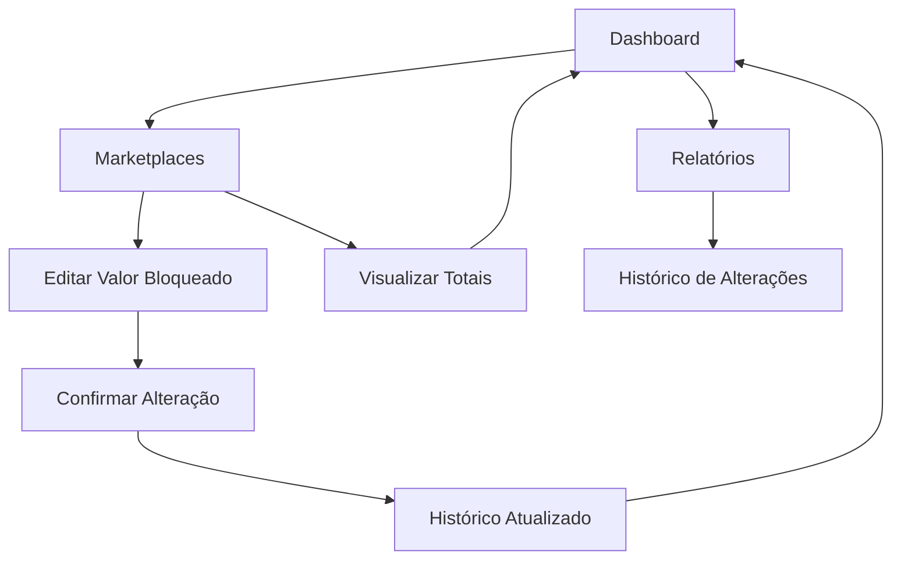

# PRD - Dinheiro a Liberar em Marketplaces

## 1. Product Overview

Sistema para controle e gestão de valores bloqueados (dinheiro a liberar) em marketplaces, permitindo o acompanhamento centralizado de recursos financeiros pendentes de liberação em diferentes plataformas.

- Controla valores bloqueados em cada marketplace individualmente
- Fornece visão consolidada de todo dinheiro bloqueado no sistema
- Integra com o dashboard principal para monitoramento em tempo real

## 2. Core Features

### 2.1 User Roles
Não há distinção de roles específicos para esta funcionalidade - todos os usuários autenticados podem visualizar e gerenciar os valores bloqueados conforme suas permissões existentes no sistema.

### 2.2 Feature Module

Nossa funcionalidade de Dinheiro a Liberar consiste das seguintes páginas principais:

1. **Marketplaces**: gestão de valores bloqueados por marketplace, edição de valores, visualização de totais.
2. **Dashboard**: resumo consolidado de valores bloqueados, indicadores de performance.
3. **Histórico**: registro de alterações nos valores bloqueados, auditoria de mudanças.

### 2.3 Page Details

| Page Name | Module Name | Feature description |
|-----------|-------------|---------------------|
| Marketplaces | Gestão de Valores Bloqueados | Adicionar, editar e visualizar valores bloqueados por marketplace. Incluir campo "Dinheiro a Liberar" em cada marketplace com validação de valores positivos. |
| Marketplaces | Totalizador de Valores | Calcular e exibir soma total de dinheiro bloqueado em todos os marketplaces ativos. Mostrar percentual por marketplace. |
| Dashboard | Resumo Financeiro | Exibir card com total de dinheiro bloqueado, comparação com período anterior, indicadores visuais de status. |
| Dashboard | Alertas de Liberação | Mostrar notificações quando valores estão próximos de liberação ou precisam de atenção. |
| Histórico | Log de Alterações | Registrar todas as mudanças nos valores bloqueados com data, usuário, valor anterior e novo valor. |
| Histórico | Relatório de Movimentação | Gerar relatórios de movimentação dos valores bloqueados por período, marketplace ou usuário. |

## 3. Core Process

**Fluxo Principal do Usuário:**

1. **Visualização**: Usuário acessa página de Marketplaces e visualiza lista com valores bloqueados
2. **Edição**: Usuário clica em marketplace específico e edita o valor bloqueado
3. **Confirmação**: Sistema valida o valor e salva a alteração no histórico
4. **Monitoramento**: Usuário visualiza no Dashboard o resumo consolidado dos valores
5. **Auditoria**: Usuário pode consultar histórico de alterações quando necessário

**Fluxo de Cálculo Automático:**
1. Sistema calcula automaticamente o total de valores bloqueados
2. Atualiza indicadores no Dashboard em tempo real
3. Gera alertas quando necessário

## 4. User Interface Design

### 4.1 Design Style

- **Cores Primárias**: Azul (#3B82F6) para valores bloqueados, Verde (#10B981) para valores liberados
- **Cores Secundárias**: Cinza (#6B7280) para textos auxiliares, Amarelo (#F59E0B) para alertas
- **Estilo de Botões**: Rounded corners (8px), hover effects, ícones integrados
- **Fontes**: Inter 14px para textos, Inter 16px Bold para títulos, Inter 12px para labels
- **Layout**: Card-based design, grid responsivo, espaçamento consistente de 16px
- **Ícones**: Lucide icons - DollarSign, TrendingUp, AlertCircle, Clock

### 4.2 Page Design Overview

| Page Name | Module Name | UI Elements |
|-----------|-------------|-------------|
| Marketplaces | Card de Marketplace | Card com nome do marketplace, valor bloqueado em destaque (fonte 18px bold), botão de edição, indicador de status ativo/inativo |
| Marketplaces | Totalizador | Card separado com fundo azul claro, ícone de dinheiro, valor total em fonte 24px bold, breakdown por marketplace |
| Dashboard | Resumo Financeiro | Card compacto com ícone, título "Dinheiro Bloqueado", valor em verde/vermelho conforme status, comparação percentual |
| Histórico | Tabela de Logs | Tabela responsiva com colunas: Data, Marketplace, Valor Anterior, Novo Valor, Usuário, badges coloridas para tipo de alteração |

### 4.3 Responsiveness

- **Desktop-first** com adaptação para mobile
- **Breakpoints**: 768px para tablet, 640px para mobile
- **Touch optimization**: Botões com área mínima de 44px, espaçamento adequado para toque
- **Grid responsivo**: 3 colunas no desktop, 2 no tablet, 1 no mobile para cards de marketplace