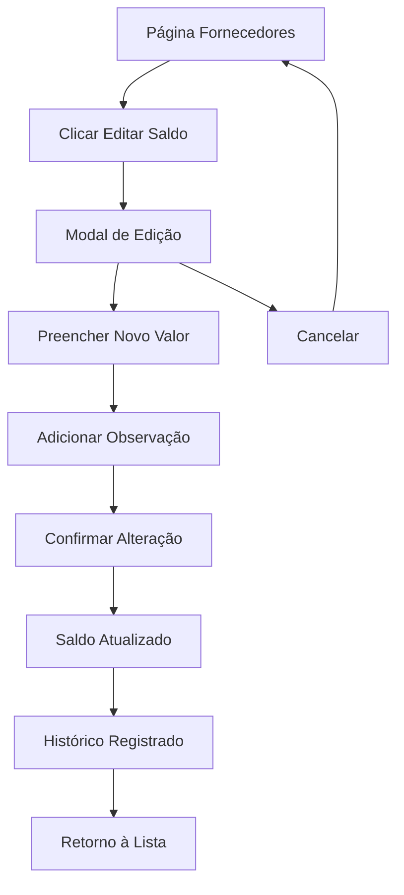

# PRD - Sistema de Edição de Saldo Devedor de Fornecedores

## 1. Visão Geral do Produto

Sistema para permitir a edição manual do saldo devedor (saldo em aberto) de cada fornecedor, oferecendo controle total sobre os valores pendentes independentemente do cálculo automático baseado em compras e pagamentos.

- **Problema a resolver**: Necessidade de ajustar manualmente o saldo devedor de fornecedores para correções, acertos ou situações especiais não cobertas pelo sistema automático.
- **Usuários**: Gestores financeiros e administradores do sistema que precisam de controle manual sobre saldos.
- **Valor do produto**: Flexibilidade total no controle de saldos devedores, permitindo ajustes manuais quando necessário.

## 2. Funcionalidades Principais

### 2.1 Papéis de Usuário

| Papel | Método de Registro | Permissões Principais |
|-------|-------------------|----------------------|
| Usuário Autenticado | Login existente | Pode visualizar e editar saldos devedores de fornecedores |

### 2.2 Módulo de Funcionalidades

Nossos requisitos consistem nas seguintes páginas principais:

1. **Página de Fornecedores**: visualização da lista de fornecedores, botão de edição de saldo devedor.
2. **Modal de Edição de Saldo**: interface para editar o saldo devedor manualmente.
3. **Página de Detalhes do Fornecedor**: visualização do histórico de ajustes de saldo.

### 2.3 Detalhes das Páginas

| Nome da Página | Nome do Módulo | Descrição da Funcionalidade |
|----------------|----------------|----------------------------|
| Página de Fornecedores | Lista de Fornecedores | Exibir botão "Editar Saldo" para cada fornecedor na tabela principal |
| Página de Fornecedores | Indicador Visual | Mostrar diferenciação visual entre saldo calculado automaticamente e saldo ajustado manualmente |
| Modal de Edição de Saldo | Formulário de Edição | Permitir inserção do novo valor do saldo devedor com máscara BRL |
| Modal de Edição de Saldo | Campo de Observação | Incluir campo obrigatório para justificar o ajuste manual |
| Modal de Edição de Saldo | Validações | Validar valores positivos e formato monetário correto |
| Página de Detalhes do Fornecedor | Histórico de Ajustes | Exibir tabela com histórico completo de ajustes manuais de saldo |
| Página de Detalhes do Fornecedor | Informações do Ajuste | Mostrar data, valor anterior, valor novo, usuário responsável e observação |

## 3. Processo Principal

### Fluxo do Usuário - Edição de Saldo Devedor

O usuário acessa a página de fornecedores, identifica o fornecedor desejado, clica no botão "Editar Saldo" ao lado do saldo atual, preenche o novo valor e observação no modal, confirma a alteração, e o sistema atualiza o saldo e registra o histórico do ajuste.

## 4. Design da Interface do Usuário

### 4.1 Estilo de Design

- **Cores primárias**: Azul (#3B82F6) para ações principais, vermelho (#EF4444) para saldos em aberto
- **Estilo de botões**: Botões arredondados com ícones, estilo moderno
- **Fonte**: Inter, tamanhos 14px para texto normal, 12px para labels
- **Layout**: Baseado em cards e tabelas, navegação superior
- **Ícones**: Lucide React, estilo outline para consistência

### 4.2 Visão Geral do Design das Páginas

| Nome da Página | Nome do Módulo | Elementos da UI |
|----------------|----------------|-----------------|
| Página de Fornecedores | Tabela de Fornecedores | Adicionar coluna "Ações" com botão "Editar Saldo" (ícone Edit3), cor azul, tamanho pequeno |
| Página de Fornecedores | Indicador de Saldo | Badge verde "Auto" para saldos calculados, badge laranja "Manual" para saldos ajustados |
| Modal de Edição | Formulário | Modal 400px largura, título "Editar Saldo Devedor", campos com labels claros |
| Modal de Edição | Campo Valor | Input com máscara BRL, placeholder "R$ 0,00", validação em tempo real |
| Modal de Edição | Campo Observação | Textarea obrigatório, placeholder "Motivo do ajuste...", máximo 500 caracteres |
| Modal de Edição | Botões de Ação | "Cancelar" (cinza) e "Salvar" (azul), alinhados à direita |
| Detalhes do Fornecedor | Histórico de Ajustes | Tabela com colunas: Data, Valor Anterior, Valor Novo, Usuário, Observação |

### 4.3 Responsividade

O produto é desktop-first com adaptação mobile. Em telas menores, o botão "Editar Saldo" se torna um ícone apenas, e o modal ocupa 95% da largura da tela.