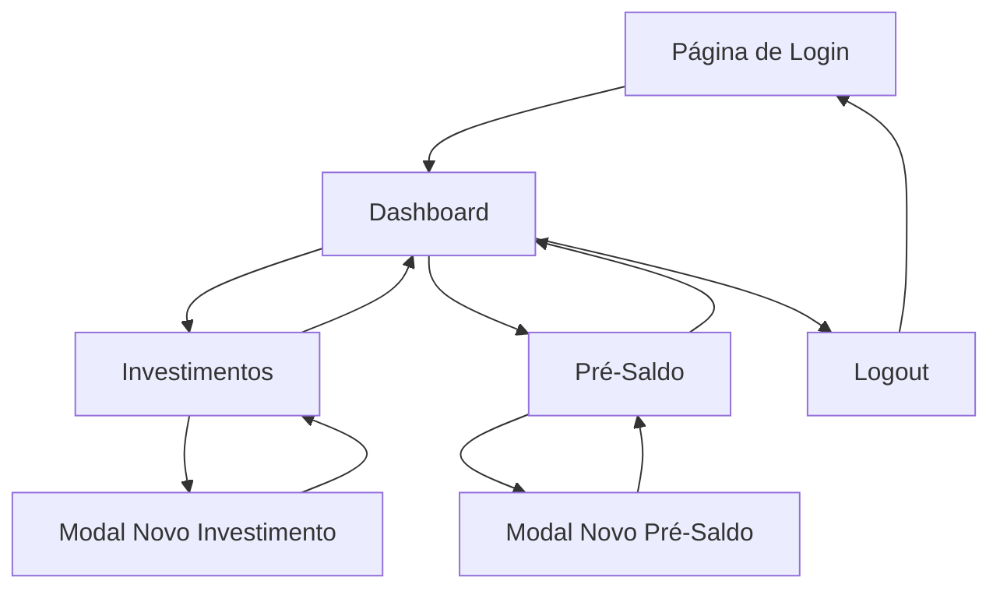

# PRD - Financeiro DEBAJEYU

## 1. Product Overview

Sistema simples de controle financeiro para gestão de investimentos e pré-saldos entre 3 sócios (Jean, Yuri, Bárbara). O sistema permite que cada sócio registre seus investimentos e pré-saldos de forma organizada e transparente.

O produto resolve o problema de controle financeiro compartilhado entre sócios, oferecendo visibilidade clara dos investimentos e saldos de cada participante, facilitando a gestão financeira colaborativa.

## 2. Core Features

### 2.1 User Roles

| Role | Registration Method | Core Permissions |
|------|---------------------|------------------|
| Usuário Admin | Pré-cadastrado no sistema | Acesso completo a todas as funcionalidades, visualização de dados de todos os sócios |

### 2.2 Feature Module

Nosso sistema financeiro consiste nas seguintes páginas principais:

1. **Página de Login**: autenticação simples com usuário e senha.
2. **Dashboard**: cards de resumo financeiro, listagem dos últimos lançamentos.
3. **Investimentos**: listagem completa de investimentos, formulário de novo lançamento.
4. **Pré-Saldo**: listagem de pré-saldos, formulário de novo lançamento.

### 2.3 Page Details

| Page Name | Module Name | Feature description |
|-----------|-------------|---------------------|
| Login | Formulário de Autenticação | Validar credenciais (usuário e senha), redirecionar para dashboard após sucesso, exibir mensagens de erro |
| Dashboard | Cards de Resumo | Exibir totais de investimentos, pré-saldos e total geral por sócio em cards visuais |
| Dashboard | Últimos Lançamentos | Listar os 10 lançamentos mais recentes (investimentos e pré-saldos) com data, tipo, sócio e valor |
| Investimentos | Listagem de Investimentos | Exibir tabela com data, descrição, setor, sócio, valor e observação, filtros e ordenação |
| Investimentos | Novo Lançamento | Modal com formulário completo (data, descrição, setor, sócio, valor, observação), validação e salvamento |
| Pré-Saldo | Listagem de Pré-Saldos | Exibir tabela com data, sócio, valor e observação, filtros e ordenação |
| Pré-Saldo | Novo Lançamento | Modal com formulário (data, sócio, valor, observação), validação e salvamento |
| Menu Lateral | Navegação | Links para Dashboard, Investimentos, Pré-Saldo e Sair, indicador de página ativa |

## 3. Core Process

**Fluxo Principal do Usuário:**

1. Usuário acessa a página de login e insere credenciais
2. Sistema valida e redireciona para o dashboard
3. No dashboard, usuário visualiza resumo financeiro e últimos lançamentos
4. Usuário navega para Investimentos ou Pré-Saldo através do menu lateral
5. Usuário pode visualizar listagens existentes ou criar novos lançamentos
6. Novos lançamentos são criados através de modais com formulários específicos
7. Usuário pode fazer logout através do menu lateral

## 4. User Interface Design

### 4.1 Design Style

- **Cores Primárias**: Azul (#3B82F6) para elementos principais, Verde (#10B981) para valores positivos
- **Cores Secundárias**: Cinza (#6B7280) para textos secundários, Branco (#FFFFFF) para fundos
- **Estilo de Botões**: Arredondados com sombra sutil, hover com transição suave
- **Fonte**: Inter ou system-ui, tamanhos 14px (corpo), 16px (títulos), 24px (cabeçalhos)
- **Layout**: Card-based com sidebar fixa, design limpo e minimalista
- **Ícones**: Lucide React icons, estilo outline, tamanho 20px padrão

### 4.2 Page Design Overview

| Page Name | Module Name | UI Elements |
|-----------|-------------|-------------|
| Login | Formulário de Autenticação | Card centralizado, campos de input com labels, botão primário azul, fundo gradiente sutil |
| Dashboard | Cards de Resumo | Grid 3x1 de cards com ícones, valores em destaque, cores diferenciadas por tipo |
| Dashboard | Últimos Lançamentos | Tabela responsiva com zebra striping, badges para tipos, formatação de moeda BRL |
| Investimentos | Listagem | Tabela com header fixo, paginação, botão "Novo Lançamento" destacado no topo direito |
| Investimentos | Modal Novo Lançamento | Modal overlay, formulário em duas colunas, botões de ação no rodapé |
| Pré-Saldo | Listagem | Mesmo padrão da tabela de investimentos, adaptado para menos campos |
| Menu Lateral | Navegação | Sidebar fixa 240px, logo no topo, itens com ícones, indicador visual de página ativa |

### 4.3 Responsiveness

O produto é desktop-first com adaptação mobile. Em telas menores (< 768px), o menu lateral se torna um drawer colapsável. Tabelas se tornam scrolláveis horizontalmente e modais ocupam toda a tela. Todos os elementos mantêm usabilidade em dispositivos touch.