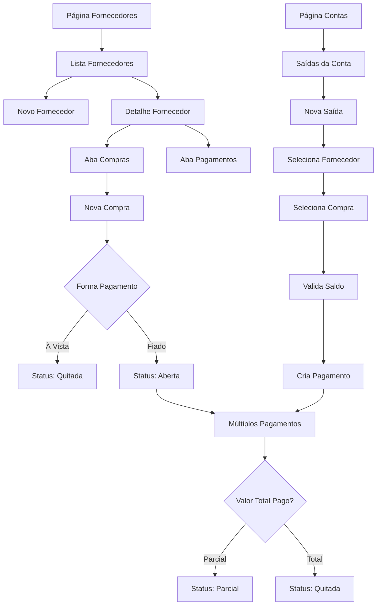

# PRD - Módulo de Fornecedores - Sistema Financeiro DEBAJEYU

## 1. Product Overview

Módulo completo de gestão de fornecedores para o sistema Financeiro DEBAJEYU, permitindo registro de despesas com fornecedores, controle de compras à vista e fiado, gestão de pagamentos parciais e integração com contas bancárias.

O módulo resolve a necessidade de controlar despesas com fornecedores de forma organizada, permitindo compras fiado com múltiplos pagamentos, rastreamento completo de gastos por fornecedor e integração com o fluxo de caixa da empresa.

## 2. Core Features

### 2.1 User Roles

| Role | Registration Method | Core Permissions |
|------|---------------------|------------------|
| Usuário Logado | Autenticação existente | Leitura de todos os dados, criação/edição/exclusão apenas dos próprios lançamentos |

### 2.2 Feature Module

O módulo de Fornecedores consiste nas seguintes funcionalidades principais:

1. **Gestão de Fornecedores**: cadastro, edição e listagem de fornecedores com tipos e status.
2. **Controle de Compras**: registro de compras à vista e fiado com categorização.
3. **Gestão de Pagamentos**: múltiplos pagamentos parciais para compras fiado.
4. **Integração com Contas**: saídas da conta Cora vinculadas a fornecedores e compras.
5. **Relatórios e Totais**: cards com totais por fornecedor e resumos gerais.
6. **Dashboard Integrado**: cards de total em aberto e pagamentos do mês.

### 2.3 Page Details

| Page Name | Module Name | Feature description |
|-----------|-------------|---------------------|
| Fornecedores | Resumo Geral | Cards com gasto total, total pago e total em aberto de todos os fornecedores |
| Fornecedores | Listagem de Fornecedores | Tabela com nome, tipo, gasto, pago, em aberto, status e ações, filtros por tipo e status |
| Fornecedores | Modal Novo Fornecedor | Formulário com nome, tipo (select), status (Ativo/Inativo), observação |
| Fornecedores | Detalhe do Fornecedor | Página específica com cards do fornecedor e abas de compras e pagamentos |
| Fornecedores | Aba Compras | Tabela de compras com data, descrição, categoria, valor total, pago, em aberto, status e ações |
| Fornecedores | Modal Nova Compra | Formulário com data, descrição, categoria, valor total, forma (à vista/fiado), vencimento opcional |
| Fornecedores | Aba Pagamentos | Tabela de pagamentos com data, conta, valor, observação, lançado por, lançado em e ações |
| Contas | Saídas da Conta | Seção adicional na página Contas com tabela de saídas vinculadas a fornecedores |
| Contas | Modal Nova Saída | Formulário com data, conta (default Cora), fornecedor, compra opcional, valor, observação |
| Dashboard | Cards Fornecedores | Dois novos cards: Total em Aberto (fornecedores) e Pagamentos do Mês |

## 3. Core Process

**Fluxo de Gestão de Fornecedores:**

1. **Cadastro de Fornecedor**: Usuário acessa página Fornecedores e cadastra novo fornecedor com tipo e observações
2. **Registro de Compra**: Na aba Compras do fornecedor, registra nova compra (à vista ou fiado)
3. **Pagamento à Vista**: Se compra à vista, status automaticamente "Quitada"
4. **Pagamento Fiado**: Se fiado, status "Aberta", permite múltiplos pagamentos parciais
5. **Registro de Pagamentos**: Via aba Pagamentos do fornecedor ou página Contas > Nova Saída
6. **Atualização Automática**: Sistema calcula saldo em aberto e atualiza status automaticamente
7. **Visualização de Totais**: Cards mostram totais atualizados por fornecedor e geral

**Fluxo de Integração com Contas:**

1. **Acesso a Contas**: Usuário navega para página Contas
2. **Nova Saída**: Clica em "Nova Saída" na seção Saídas da Conta
3. **Seleção de Fornecedor**: Escolhe fornecedor no select
4. **Vinculação de Compra**: Opcionalmente seleciona compra específica (apenas compras em aberto)
5. **Validação**: Sistema valida se valor não excede saldo em aberto
6. **Salvamento**: Cria pagamento vinculado e atualiza status da compra
7. **Reflexão**: Saída aparece na conta Cora e no histórico do fornecedor

## 4. User Interface Design

### 4.1 Design Style

- **Cores Primárias**: Vermelho (#EF4444) para despesas e valores negativos, Azul (#3B82F6) para ações
- **Cores Secundárias**: Verde (#10B981) para status "Quitada", Amarelo (#F59E0B) para "Parcial", Cinza (#6B7280) para "Aberta"
- **Estilo de Botões**: Consistente com o sistema existente, arredondados com sombra sutil
- **Fonte**: Inter ou system-ui, mantendo padrões existentes
- **Layout**: Card-based com tabelas responsivas, seguindo padrão do sistema
- **Ícones**: Lucide React icons - Building2 para fornecedores, ShoppingCart para compras, CreditCard para pagamentos

### 4.2 Page Design Overview

| Page Name | Module Name | UI Elements |
|-----------|-------------|-------------|
| Fornecedores | Resumo Geral | Grid 3x1 de cards com ícones, valores em vermelho para despesas, formatação BRL |
| Fornecedores | Listagem | Tabela responsiva com badges coloridos para status, botão "Novo Fornecedor" destacado |
| Fornecedores | Modal Novo Fornecedor | Modal overlay, formulário em coluna única, select para tipo, toggle para status |
| Fornecedores | Detalhe Fornecedor | Header com nome e tipo, cards 3x1 específicos, tabs para Compras e Pagamentos |
| Fornecedores | Aba Compras | Tabela com progress bar visual para % pago, badges para status, botão "Nova Compra" |
| Fornecedores | Modal Nova Compra | Formulário em duas colunas, toggle à vista/fiado, campo vencimento condicional |
| Fornecedores | Aba Pagamentos | Tabela com formatação de data/hora, badge da conta, valores em vermelho |
| Contas | Saídas da Conta | Seção separada com título, tabela similar às entradas mas com cores vermelhas |
| Contas | Modal Nova Saída | Formulário com selects dependentes (fornecedor → compras), validação visual |
| Dashboard | Cards Fornecedores | Cards com ícones específicos, valores em vermelho, links para página Fornecedores |

### 4.3 Responsiveness

Mantém padrão do sistema existente: desktop-first com adaptação mobile. Em telas menores, tabelas se tornam scrolláveis horizontalmente, modais ocupam tela inteira, cards se empilham verticalmente. Selects dependentes mantêm funcionalidade em dispositivos touch.

## 5. Regras de Negócio

### 5.1 Estrutura de Dados

**Fornecedores:**
- nome (obrigatório, único)
- tipo (select: Camisa, Gráfica, Outros)
- status (Ativo/Inativo, default Ativo)
- observacao (opcional)

**Compras:**
- fornecedor_id (obrigatório, FK)
- data (obrigatório)
- descricao (obrigatório)
- categoria (obrigatório)
- valor_total (obrigatório, BRL mascarado)
- forma (À Vista/Fiado)
- vencimento (opcional, apenas se Fiado)
- status (calculado: Aberta/Parcial/Quitada)

**Pagamentos:**
- compra_id (obrigatório, FK)
- conta_id (obrigatório, FK - Cora)
- data_pagamento (obrigatório)
- valor_pago (obrigatório, BRL mascarado)
- observacao (opcional)
- usuario_id (automático, usuário logado)
- created_at (timestamp automático)

### 5.2 Cálculos Automáticos

**Status da Compra:**
- Aberta: valor_pago = 0
- Parcial: 0 < valor_pago < valor_total
- Quitada: valor_pago = valor_total

**Saldo em Aberto (por compra):**
- saldo_aberto = valor_total - soma(pagamentos.valor_pago)

**Totais por Fornecedor:**
- Gasto: soma(compras.valor_total)
- Pago: soma(pagamentos.valor_pago)
- Em Aberto: soma(saldos_abertos das compras Abertas/Parciais)

### 5.3 Validações

**Nova Compra:**
- Data não pode ser futura
- Valor total > 0
- Se Fiado, vencimento é opcional mas recomendado

**Novo Pagamento:**
- Data não pode ser futura
- Valor > 0
- Valor não pode exceder saldo em aberto da compra
- Compra deve estar Aberta ou Parcial

**Exclusões:**
- Fornecedor: apenas se não tiver compras
- Compra: apenas se não tiver pagamentos
- Pagamento: sempre permitido (recalcula status da compra)

### 5.4 Segurança (RLS)

**Leitura:**
- Todos os usuários logados podem ler todos os dados
- Agregações (totais) liberadas para usuários logados

**Escrita:**
- Criar/Editar/Excluir apenas próprios lançamentos
- Campo usuario_id preenchido automaticamente
- Validação no backend para garantir propriedade

## 6. Critérios de Aceite

### 6.1 Funcionalidades Básicas

✅ **Cadastro de Fornecedor:**
- Criar fornecedor com nome, tipo e observação
- Validar nome único
- Status padrão Ativo

✅ **Registro de Compra Fiado:**
- Criar compra fiado com valor total
- Status inicial "Aberta"
- Saldo em aberto = valor total

✅ **Múltiplos Pagamentos:**
- Registrar pagamento parcial
- Status muda para "Parcial"
- Saldo em aberto reduz
- Último pagamento muda status para "Quitada"

### 6.2 Integração com Contas

✅ **Nova Saída:**
- Selecionar fornecedor
- Selecionar compra (apenas em aberto)
- Validar valor não excede saldo
- Criar pagamento vinculado
- Atualizar status da compra

✅ **Reflexão na Conta:**
- Saída aparece na conta Cora
- Histórico completo de auditoria
- Totais batem entre Fornecedor e Conta

### 6.3 Totais e Relatórios

✅ **Cards por Fornecedor:**
- Gasto: soma de todas as compras
- Pago: soma de todos os pagamentos
- Em Aberto: soma dos saldos das compras não quitadas

✅ **Cards Gerais:**
- Total em Aberto: soma de todos os fornecedores
- Pagamentos do Mês: soma das saídas do mês atual

✅ **Dashboard Integrado:**
- Novos cards não quebram layout existente
- Links funcionais para página Fornecedores
- Valores atualizados em tempo real

### 6.4 UX e Validações

✅ **Filtros e Busca:**
- Filtrar por tipo de fornecedor
- Filtrar por status (Ativo/Inativo)
- Filtrar compras por status (Aberta/Parcial/Quitada)
- Filtrar por período

✅ **Confirmações:**
- Confirmar exclusão de fornecedor
- Bloquear exclusão de compra com pagamentos
- Alertar sobre valores que excedem saldo

✅ **Auditoria:**
- Mostrar quem lançou cada pagamento
- Mostrar quando foi lançado (data/hora)
- Histórico completo de alterações

## 7. Impacto no Sistema Existente

### 7.1 Alterações Mínimas

**Menu de Navegação:**
- Adicionar item "Fornecedores" entre Marketplaces e Sócios
- Manter ordem: Dashboard • Investimentos • Contas • Marketplaces • **Fornecedores** • Sócios • Sair

**Dashboard:**
- Adicionar 2 novos cards na grid existente
- Manter layout responsivo
- Não alterar cards existentes

**Página Contas:**
- Adicionar seção "Saídas da Conta" abaixo das entradas
- Manter funcionalidade existente intacta
- Usar componentes similares às entradas

### 7.2 Componentes Reutilizados

**CurrencyInput:**
- Usar componente existente para valores
- Manter máscara BRL (787,87)
- Manter validações existentes

**Modais e Formulários:**
- Seguir padrão dos modais existentes
- Reutilizar componentes de UI
- Manter consistência visual

**Tabelas e Cards:**
- Usar componentes de tabela existentes
- Manter padrão de cards do dashboard
- Seguir sistema de cores estabelecido

### 7.3 Migrações de Banco

**Novas Tabelas:**
- fornecedores
- compras
- pagamentos_fornecedores

**Sem Alterações:**
- Não alterar tabelas existentes
- Não renomear campos
- Manter relacionamentos existentes

**RLS Policies:**
- Seguir padrão das policies existentes
- Manter segurança consistente
- Não afetar policies existentes