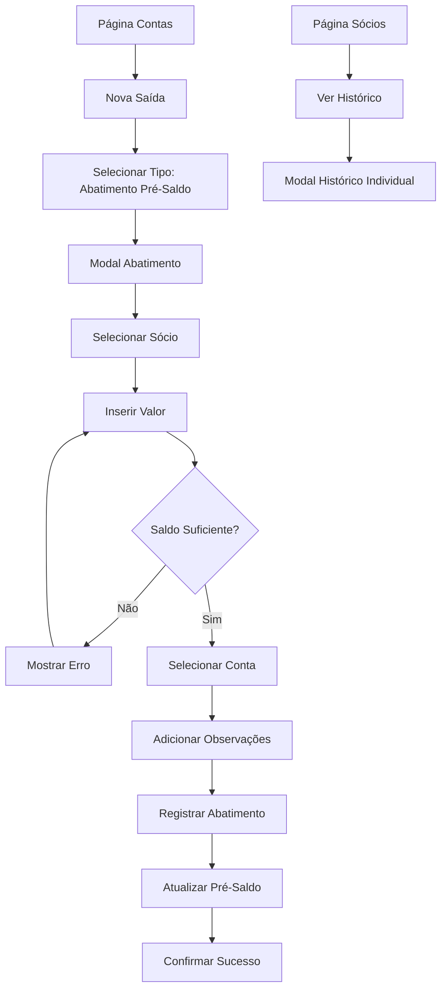

# PRD - Sistema de Abatimento de Pré-Saldo dos Sócios

## 1. Visão Geral do Produto

Sistema para registrar e rastrear abatimentos do pré-saldo dos sócios no sistema financeiro DEBAJEYU, permitindo controle detalhado das deduções e manutenção de histórico completo.

- O sistema resolve a necessidade de controlar pagamentos e deduções dos pré-saldos dos sócios de forma organizada e auditável.
- Será utilizado pelos gestores financeiros para registrar saídas relacionadas aos sócios e manter transparência nas operações.
- O produto visa aumentar a transparência e controle financeiro, facilitando a gestão dos recursos dos sócios.

## 2. Funcionalidades Principais

### 2.1 Papéis de Usuário

| Papel | Método de Registro | Permissões Principais |
|-------|-------------------|----------------------|
| Usuário Autenticado | Login existente no sistema | Pode registrar abatimentos, visualizar histórico e gerar relatórios |

### 2.2 Módulo de Funcionalidades

Nossos requisitos do sistema de abatimento consistem nas seguintes páginas principais:

1. **Página de Contas (Atualizada)**: nova opção de saída "Abatimento Pré-Saldo", seleção de sócio, validação de saldo disponível.
2. **Modal de Abatimento**: formulário específico para registrar abatimentos, campos de sócio, valor, data e observações.
3. **Histórico de Abatimentos**: visualização completa dos abatimentos por sócio, filtros por período e sócio.
4. **Página de Sócios (Atualizada)**: exibição do saldo atual atualizado, botão para ver histórico de abatimentos.

### 2.3 Detalhes das Páginas

| Nome da Página | Nome do Módulo | Descrição da Funcionalidade |
|----------------|----------------|----------------------------|
| Contas | Nova Saída - Abatimento | Adicionar nova opção "Abatimento Pré-Saldo" no dropdown de tipos de saída. Selecionar sócio, validar saldo disponível, registrar valor e observações. |
| Modal Abatimento | Formulário de Registro | Criar formulário específico com campos: sócio (dropdown), valor (currency input), data, conta de destino, observações. Validar saldo suficiente antes de permitir registro. |
| Histórico Abatimentos | Lista de Transações | Exibir tabela com todos os abatimentos registrados. Incluir filtros por sócio, período, valor. Mostrar data, sócio, valor, conta, observações e saldo restante após operação. |
| Sócios | Saldo Atualizado | Atualizar exibição do pré-saldo em tempo real. Adicionar botão "Ver Histórico" que abre modal com abatimentos específicos do sócio. |
| Sócios | Modal Histórico Individual | Mostrar histórico de abatimentos específico de um sócio. Incluir gráfico de evolução do saldo ao longo do tempo. |

## 3. Processo Principal

**Fluxo Principal do Usuário:**

1. Usuário acessa a página "Contas" e clica em "Nova Saída"
2. Seleciona o tipo "Abatimento Pré-Saldo" no dropdown
3. Sistema exibe formulário específico para abatimento
4. Usuário seleciona o sócio no dropdown (mostra saldo atual)
5. Insere valor do abatimento (sistema valida se há saldo suficiente)
6. Seleciona conta de destino e adiciona observações
7. Sistema registra a transação e atualiza o pré-saldo do sócio
8. Usuário pode visualizar o histórico na página de Sócios ou no histórico geral

## 4. Design da Interface do Usuário

### 4.1 Estilo de Design

- **Cores Primárias**: Manter consistência com o tema atual (azul #3b82f6, verde para sucesso #10b981)
- **Cores Secundárias**: Vermelho para alertas de saldo insuficiente (#ef4444), cinza para textos secundários
- **Estilo de Botões**: Rounded corners, estilo moderno consistente com shadcn/ui
- **Fontes**: Inter ou system fonts, tamanhos 14px para texto normal, 16px para labels
- **Layout**: Card-based design, navegação top-level, modais centralizados
- **Ícones**: Lucide icons para consistência (Minus para abatimentos, History para histórico)

### 4.2 Visão Geral do Design das Páginas

| Nome da Página | Nome do Módulo | Elementos da UI |
|----------------|----------------|-----------------|
| Contas | Dropdown Tipo Saída | Adicionar opção "Abatimento Pré-Saldo" com ícone Minus. Cor diferenciada (laranja #f59e0b) para distinguir de outros tipos. |
| Modal Abatimento | Formulário Principal | Layout em 2 colunas: esquerda (sócio, valor), direita (conta, data). Card de resumo mostrando saldo atual e saldo após operação. Botões Cancel/Confirm com cores apropriadas. |
| Histórico | Tabela de Dados | Tabela responsiva com colunas: Data, Sócio, Valor, Conta, Saldo Restante, Ações. Filtros no topo em cards compactos. Paginação no rodapé. |
| Sócios | Card de Saldo | Atualizar cards dos sócios para mostrar pré-saldo com destaque visual. Botão "Ver Histórico" como link secundário abaixo do saldo. |
| Modal Histórico Individual | Visualização Detalhada | Gráfico de linha mostrando evolução do saldo. Tabela resumida abaixo. Header com nome do sócio e saldo atual destacado. |

### 4.3 Responsividade

O produto é desktop-first com adaptação mobile. Em dispositivos móveis, o modal de abatimento muda para layout de coluna única, e a tabela de histórico utiliza cards empilhados ao invés de tabela tradicional. Touch interactions otimizadas para seleção de sócios e inserção de valores.