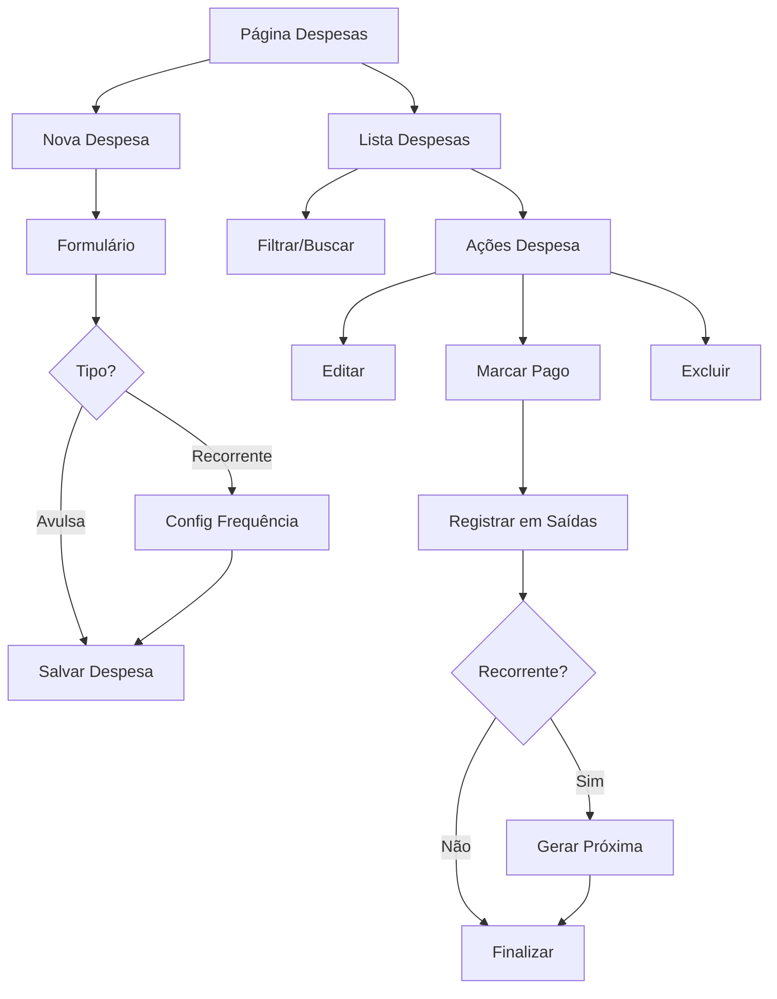

# PRD - Sistema de Gestão de Despesas

## 1. Product Overview

Sistema completo para gestão de despesas recorrentes e avulsas no Financeiro DEBAJEYU, permitindo controle eficiente de gastos com integração automática ao fluxo de saídas financeiras.

O sistema resolve o problema de controle e acompanhamento de despesas fixas e variáveis, oferecendo visibilidade completa do fluxo de caixa e automatizando o processo de registro de pagamentos.

## 2. Core Features

### 2.1 User Roles
Não há distinção de roles específicos para este módulo - todos os usuários autenticados têm acesso completo às funcionalidades de despesas.

### 2.2 Feature Module

O sistema de despesas consiste nas seguintes páginas principais:

1. **Página de Despesas**: listagem completa, filtros avançados, ações de gestão
2. **Modal de Criação/Edição**: formulário para despesas recorrentes e avulsas
3. **Integração com Saídas**: visualização automática na aba de saídas quando pago

### 2.3 Page Details

| Page Name | Module Name | Feature description |
|-----------|-------------|---------------------|
| Página de Despesas | Lista de Despesas | Exibir todas as despesas com status, tipo, valor, vencimento. Filtros por status (pendente/pago), tipo (recorrente/avulsa), categoria, período |
| Página de Despesas | Ações de Despesa | Criar nova despesa, editar existente, marcar como pago, excluir, visualizar detalhes |
| Página de Despesas | Filtros Avançados | Filtrar por status, tipo, categoria, período de vencimento, valor mínimo/máximo |
| Modal de Despesa | Formulário de Criação | Campos: descrição, valor, categoria, tipo (recorrente/avulsa), data vencimento, observações |
| Modal de Despesa | Configuração Recorrente | Para despesas recorrentes: frequência (mensal, bimestral, trimestral, semestral, anual), data próxima ocorrência |
| Modal de Despesa | Validações | Validar campos obrigatórios, formato de valor, datas válidas, categoria existente |
| Integração Saídas | Registro Automático | Quando despesa marcada como paga, criar registro automático na tabela saídas com tipo "despesa" |
| Integração Saídas | Geração Recorrente | Para despesas recorrentes pagas, gerar automaticamente próxima ocorrência com nova data |

## 3. Core Process

**Fluxo Principal de Despesas:**

1. **Criação de Despesa**: Usuário acessa página de despesas → clica "Nova Despesa" → preenche formulário → seleciona tipo (recorrente/avulsa) → salva
2. **Gestão de Despesas**: Usuário visualiza lista → aplica filtros → seleciona despesa → edita ou marca como pago
3. **Pagamento de Despesa**: Usuário marca despesa como pago → sistema registra na tabela saídas → atualiza saldo → gera próxima ocorrência (se recorrente)
4. **Visualização em Saídas**: Despesa paga aparece automaticamente na aba "Saídas" da página Contas

**Fluxo de Despesas Recorrentes:**

1. **Configuração**: Usuário cria despesa recorrente → define frequência → sistema calcula próximas datas
2. **Geração Automática**: Quando despesa recorrente é paga → sistema gera próxima ocorrência automaticamente
3. **Controle Contínuo**: Usuário tem visibilidade de todas as ocorrências futuras e passadas

## 4. User Interface Design

### 4.1 Design Style

- **Cores Primárias**: Azul (#3B82F6) para ações principais, Verde (#10B981) para status pago
- **Cores Secundárias**: Laranja (#F59E0B) para pendente, Vermelho (#EF4444) para vencido
- **Estilo de Botões**: Rounded corners (8px), sombra sutil, hover effects
- **Fonte**: Inter, tamanhos 14px (corpo), 16px (títulos), 12px (labels)
- **Layout**: Card-based com grid responsivo, navegação top-level
- **Ícones**: Lucide React icons, estilo outline, tamanho 20px

### 4.2 Page Design Overview

| Page Name | Module Name | UI Elements |
|-----------|-------------|-------------|
| Página de Despesas | Header | Título "Despesas", botão "Nova Despesa" (azul, ícone +), contador total de despesas |
| Página de Despesas | Filtros | Barra de busca, filtros dropdown (Status, Tipo, Categoria), filtro de período com date picker |
| Página de Despesas | Lista | Cards ou tabela com colunas: Descrição, Valor (BRL), Categoria (badge colorido), Tipo (recorrente/avulsa), Status (badge), Vencimento, Ações |
| Página de Despesas | Status Badges | Pendente (laranja), Pago (verde), Vencido (vermelho), com ícones correspondentes |
| Página de Despesas | Ações | Botões: Editar (ícone lápis), Pagar (ícone check), Excluir (ícone trash), menu dropdown |
| Modal de Despesa | Formulário | Layout em 2 colunas, campos com labels claros, validação em tempo real, botões Cancelar/Salvar |
| Modal de Despesa | Campos Recorrentes | Toggle para ativar recorrência, dropdown frequência, preview próximas datas |
| Página de Despesas | Estados Vazios | Ilustração + texto motivacional quando não há despesas, botão CTA para criar primeira |

### 4.3 Responsiveness

Desktop-first com adaptação mobile completa. Em mobile, tabela vira cards empilhados, filtros colapsam em drawer, formulários ajustam para single-column. Touch-friendly com botões mínimo 44px.