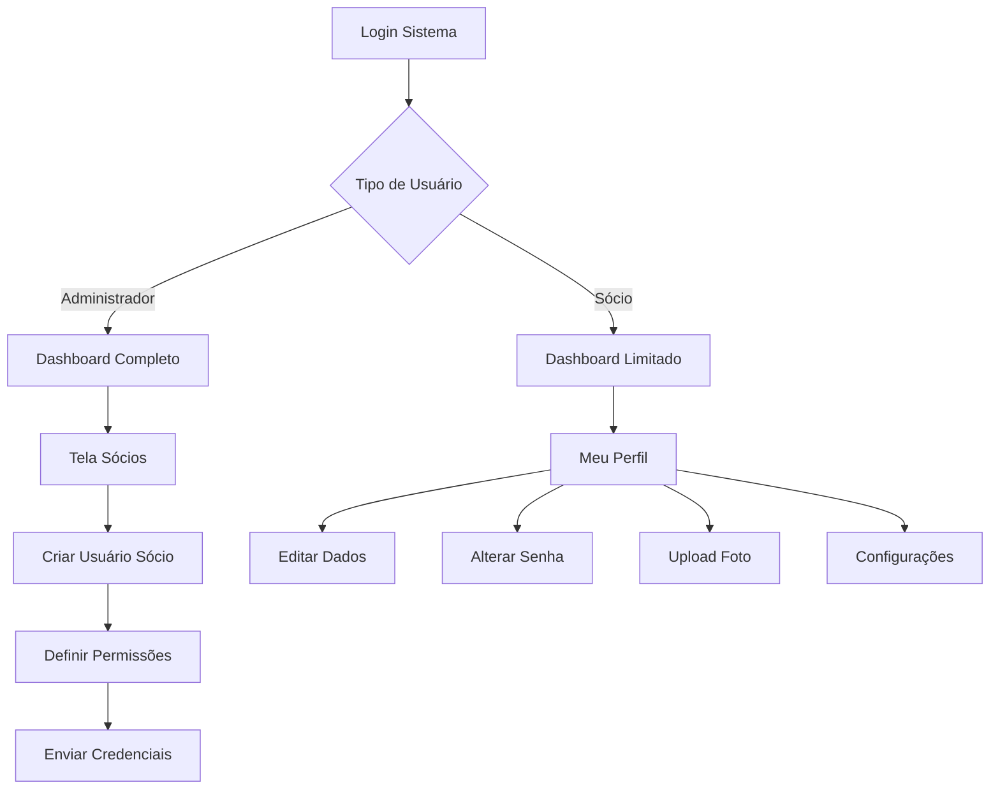

# Sistema de Gestão de Usuários dos Sócios - PRD

## 1. Product Overview
Sistema completo de gestão de usuários para permitir que os sócios tenham acesso controlado ao sistema financeiro DEBAJEYU, com funcionalidades de criação de contas, gerenciamento de perfis e personalização de usuários.

- O sistema resolve a necessidade de dar acesso individual aos sócios, permitindo que cada um visualize e gerencie suas informações financeiras de forma segura e personalizada.
- Destinado aos administradores do sistema (para criar e gerenciar usuários) e aos próprios sócios (para personalizar seus perfis e acessar o sistema).

## 2. Core Features

### 2.1 User Roles

| Role | Registration Method | Core Permissions |
|------|---------------------|------------------|
| Administrador | Acesso total existente | Pode criar, editar e desativar usuários dos sócios, gerenciar todas as funcionalidades |
| Sócio | Criado pelo administrador | Pode visualizar seus dados financeiros, editar seu perfil, alterar senha e foto |
| Sócio Limitado | Criado pelo administrador com restrições | Acesso apenas de visualização aos seus dados financeiros |

### 2.2 Feature Module

O sistema de gestão de usuários dos sócios consiste nas seguintes páginas principais:

1. **Tela Sócios Expandida**: gestão de usuários, criação de contas, controle de permissões.
2. **Perfil do Usuário**: edição de dados pessoais, upload de foto, alteração de senha.
3. **Configurações de Acesso**: definição de permissões, níveis de acesso, ativação/desativação.

### 2.3 Page Details

| Page Name | Module Name | Feature description |
|-----------|-------------|---------------------|
| Tela Sócios Expandida | Gestão de Usuários | Criar novo usuário para sócio, definir permissões (admin/sócio/limitado), ativar/desativar contas, visualizar lista de usuários ativos |
| Tela Sócios Expandida | Controle de Acesso | Definir quais módulos cada usuário pode acessar, configurar permissões específicas, histórico de acessos |
| Perfil do Usuário | Dados Pessoais | Editar nome, email, telefone, informações de contato, validação de dados obrigatórios |
| Perfil do Usuário | Foto de Perfil | Upload de imagem, crop/redimensionamento automático, preview da foto, remoção de foto |
| Perfil do Usuário | Alteração de Senha | Validação de senha atual, definição de nova senha segura, confirmação de senha, logout automático após alteração |
| Perfil do Usuário | Preferências | Configurações de notificações, tema da interface, idioma, configurações de dashboard |

## 3. Core Process

### Fluxo do Administrador:
1. Acessa a tela Sócios
2. Seleciona um sócio existente
3. Clica em "Criar Usuário" para o sócio
4. Define permissões e nível de acesso
5. Envia credenciais de acesso para o sócio
6. Pode gerenciar e modificar permissões posteriormente

### Fluxo do Sócio:
1. Recebe credenciais de acesso do administrador
2. Faz login no sistema pela primeira vez
3. É direcionado para completar seu perfil
4. Pode alterar senha, adicionar foto e personalizar configurações
5. Acessa apenas os módulos permitidos pelo administrador

## 4. User Interface Design

### 4.1 Design Style
- **Cores primárias**: Azul corporativo (#2563eb), Verde sucesso (#16a34a)
- **Cores secundárias**: Cinza neutro (#64748b), Branco (#ffffff)
- **Estilo de botões**: Rounded corners (8px), hover effects suaves
- **Fonte**: Inter, tamanhos 14px (corpo), 16px (títulos), 12px (labels)
- **Layout**: Card-based design, navegação lateral consistente
- **Ícones**: Lucide React icons, estilo outline, tamanho 20px
- **Avatares**: Círculos com iniciais quando sem foto, bordas suaves

### 4.2 Page Design Overview

| Page Name | Module Name | UI Elements |
|-----------|-------------|-------------|
| Tela Sócios Expandida | Gestão de Usuários | Cards dos sócios com botão "Gerenciar Usuário", modal de criação com formulário, tabela de usuários com status (ativo/inativo), badges de permissões |
| Tela Sócios Expandida | Controle de Acesso | Checkboxes para módulos acessíveis, toggle switches para permissões, histórico em timeline, filtros por status |
| Perfil do Usuário | Dados Pessoais | Formulário em duas colunas, campos com validação em tempo real, botões de salvar/cancelar, mensagens de sucesso/erro |
| Perfil do Usuário | Foto de Perfil | Área de drag & drop para upload, preview circular da imagem, botões para editar/remover, progress bar durante upload |
| Perfil do Usuário | Alteração de Senha | Campos com eye toggle para mostrar/ocultar senha, indicador de força da senha, confirmação visual, modal de confirmação |

### 4.3 Responsiveness
- **Desktop-first** com adaptação mobile
- **Breakpoints**: 768px (tablet), 640px (mobile)
- **Touch optimization**: Botões maiores em mobile (44px mínimo)
- **Navigation**: Menu hambúrguer em mobile, sidebar colapsível em tablet