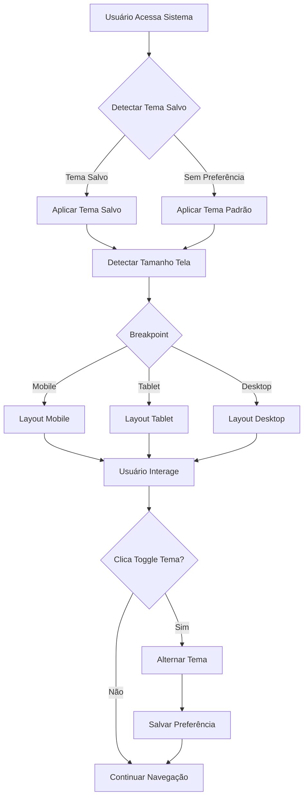

# PRD - Sistema de Tema Dark e Responsividade Mobile

## 1. Visão Geral do Produto

Sistema de alternância entre tema claro e escuro com responsividade completa para dispositivos móveis, proporcionando uma experiência de usuário moderna e acessível em qualquer dispositivo.

- **Objetivo**: Implementar tema dark/light toggle e garantir experiência otimizada em dispositivos móveis
- **Benefícios**: Melhor usabilidade, redução de fadiga visual, acessibilidade em diferentes condições de luz e dispositivos

## 2. Funcionalidades Principais

### 2.1 Papéis de Usuário
Todos os usuários existentes (Administrador, Sócio, Usuário) terão acesso às mesmas funcionalidades de tema e responsividade.

### 2.2 Módulos de Funcionalidade

Nosso sistema de tema e responsividade consiste nos seguintes módulos principais:

1. **Sistema de Tema**: toggle dark/light, persistência de preferência, aplicação global
2. **Layout Responsivo**: adaptação para mobile, tablet e desktop
3. **Componentes Adaptativos**: tabelas, formulários e navegação otimizados
4. **Configurações de Usuário**: preferências salvas e sincronizadas

### 2.3 Detalhes das Páginas

| Nome da Página | Nome do Módulo | Descrição da Funcionalidade |
|----------------|----------------|------------------------------|
| Todas as Páginas | Theme Toggle | Botão de alternância entre tema claro/escuro no header, transição suave, ícone sol/lua |
| Todas as Páginas | Layout Responsivo | Adaptação automática para telas 320px+, breakpoints otimizados, componentes flexíveis |
| Dashboard | Cards Responsivos | Cards que se reorganizam em coluna única em mobile, métricas empilhadas |
| Sidebar | Menu Colapsável | Menu lateral que se transforma em hambúrguer menu em mobile, overlay em telas pequenas |
| Tabelas | Scroll Horizontal | Tabelas com scroll horizontal em mobile, colunas prioritárias visíveis |
| Formulários | Touch Optimized | Campos maiores para touch, espaçamento adequado, validação visual melhorada |
| Modais | Mobile Friendly | Modais que ocupam tela inteira em mobile, botões acessíveis |

## 3. Fluxo Principal

**Fluxo de Alternância de Tema:**
1. Usuário clica no toggle de tema no header
2. Sistema aplica novo tema instantaneamente
3. Preferência é salva no localStorage
4. Tema é mantido em futuras sessões

**Fluxo de Responsividade:**
1. Sistema detecta tamanho da tela automaticamente
2. Layout se adapta aos breakpoints definidos
3. Componentes se reorganizam conforme necessário
4. Navegação se ajusta para touch em mobile

## 4. Design da Interface

### 4.1 Estilo de Design

**Tema Claro:**
- Cores primárias: #3B82F6 (azul), #10B981 (verde)
- Background: #FFFFFF, #F8FAFC
- Texto: #1F2937, #6B7280
- Bordas: #E5E7EB

**Tema Escuro:**
- Cores primárias: #60A5FA (azul claro), #34D399 (verde claro)
- Background: #111827, #1F2937
- Texto: #F9FAFB, #D1D5DB
- Bordas: #374151

**Elementos Comuns:**
- Transições suaves (300ms ease-in-out)
- Sombras adaptáveis por tema
- Ícones com contraste adequado
- Botões com estados hover/focus otimizados

### 4.2 Visão Geral do Design das Páginas

| Nome da Página | Nome do Módulo | Elementos da UI |
|----------------|----------------|-----------------|
| Header Global | Theme Toggle | Switch animado com ícones sol/lua, posicionado no canto superior direito |
| Sidebar | Navigation Menu | Menu colapsável com ícones, transforma em hambúrguer em mobile (<768px) |
| Dashboard | Responsive Cards | Grid 4 colunas desktop → 2 colunas tablet → 1 coluna mobile, espaçamento adaptativo |
| Tabelas | Data Display | Scroll horizontal em mobile, colunas fixas prioritárias, paginação touch-friendly |
| Formulários | Input Fields | Campos com altura mínima 44px (touch target), labels flutuantes, validação visual |
| Modais | Overlay Components | Fullscreen em mobile (<640px), centered em desktop, backdrop blur |

### 4.3 Responsividade

**Breakpoints Definidos:**
- Mobile: 320px - 767px (layout em coluna única, menu hambúrguer)
- Tablet: 768px - 1023px (layout híbrido, sidebar colapsável)
- Desktop: 1024px+ (layout completo, sidebar expandida)

**Otimizações Touch:**
- Botões mínimo 44x44px
- Espaçamento entre elementos interativos: 8px+
- Gestos de swipe para navegação em tabelas
- Feedback visual imediato em toques